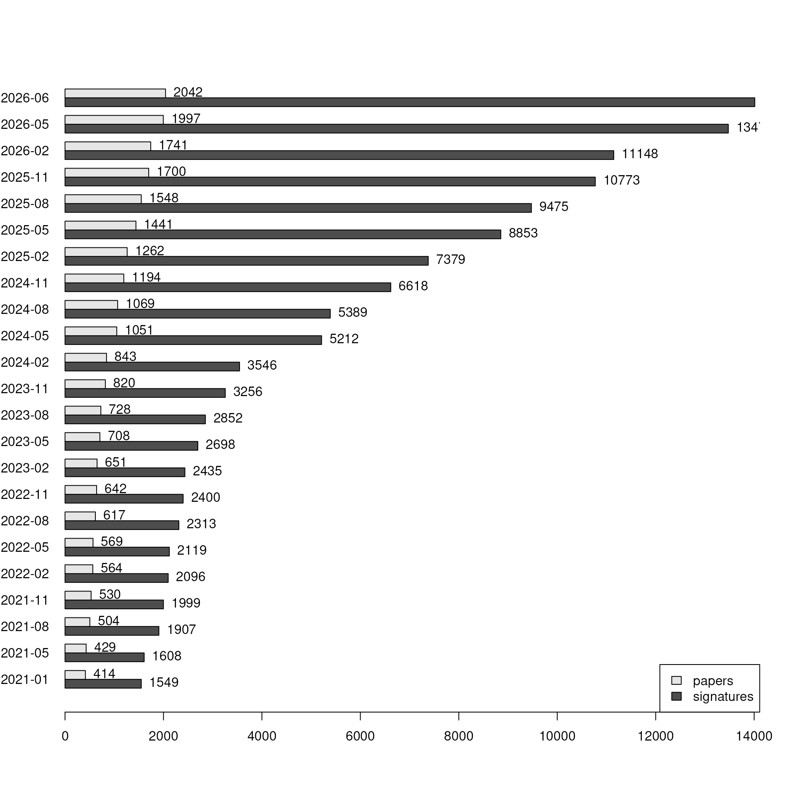
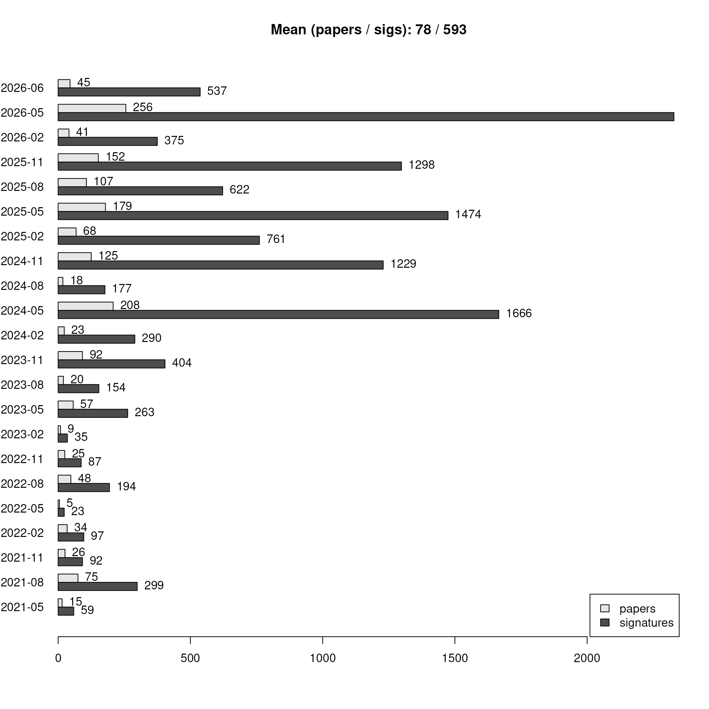
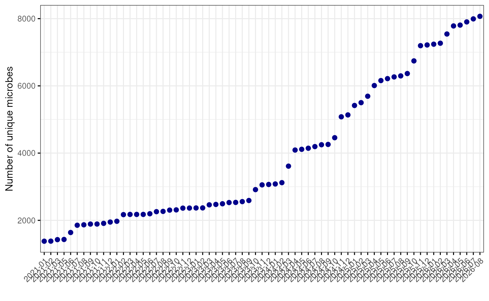
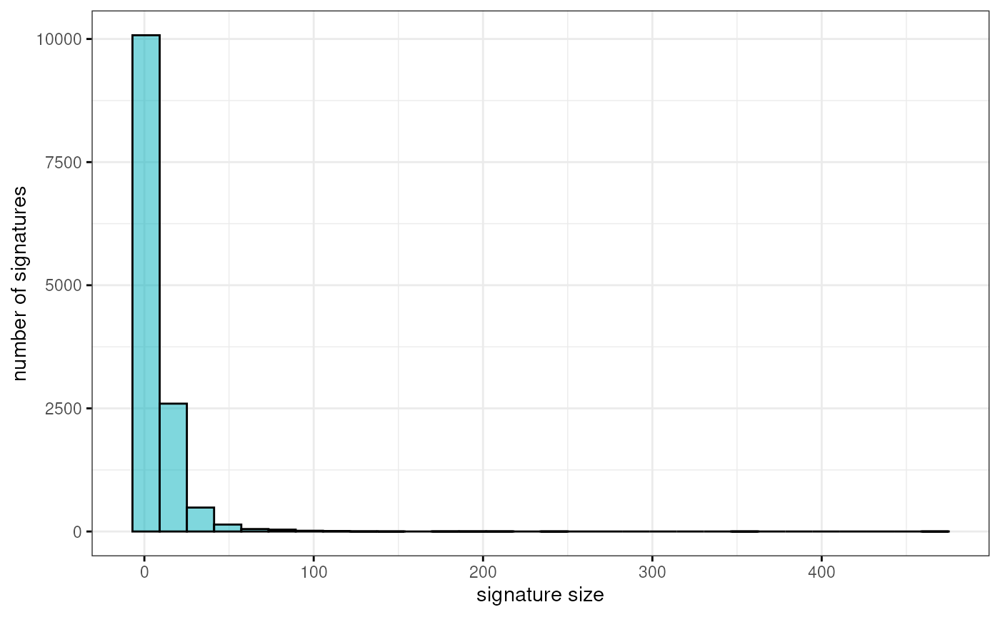
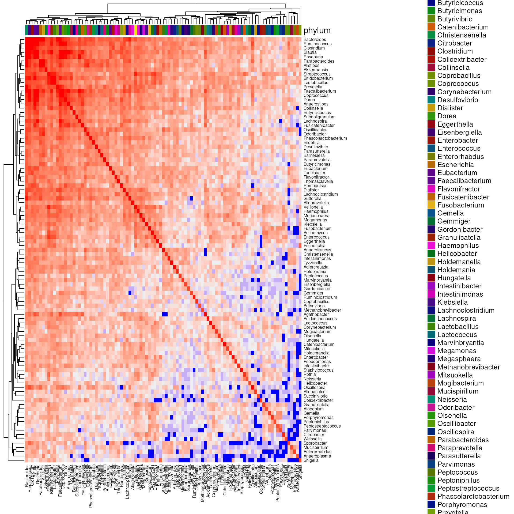
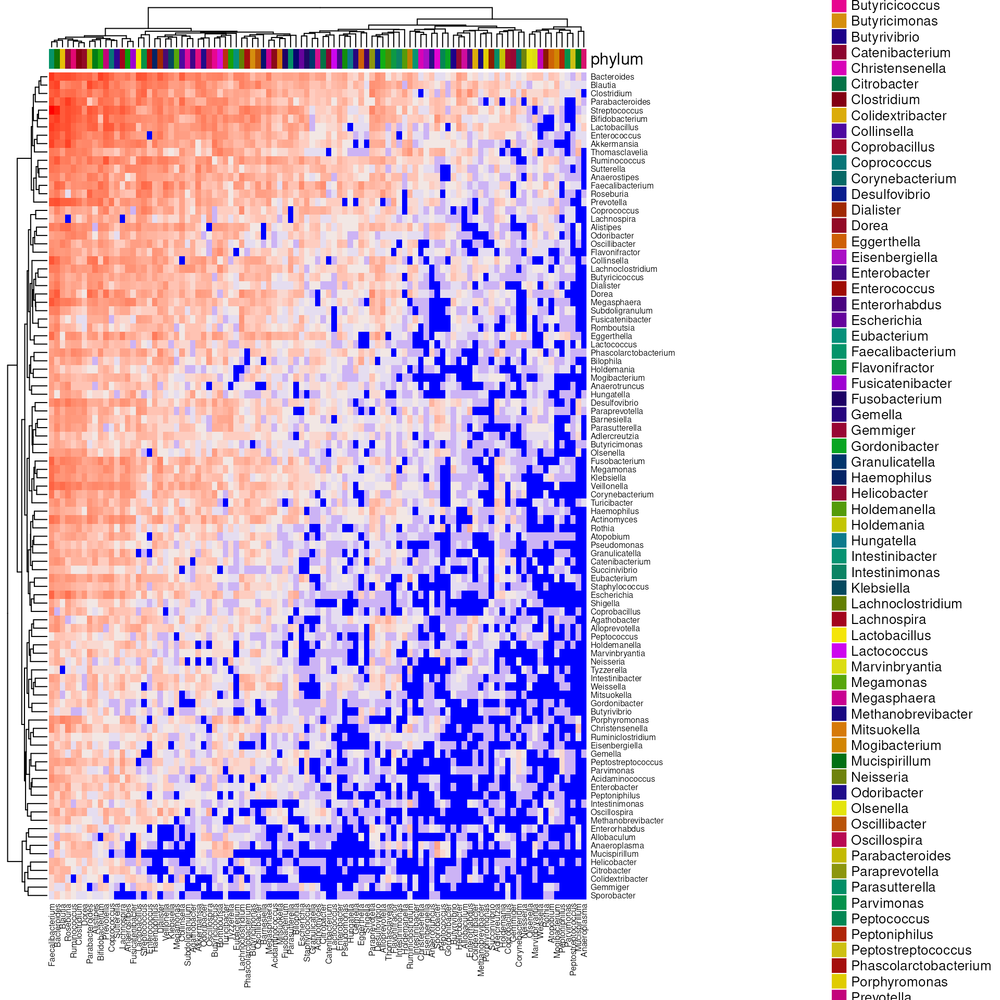
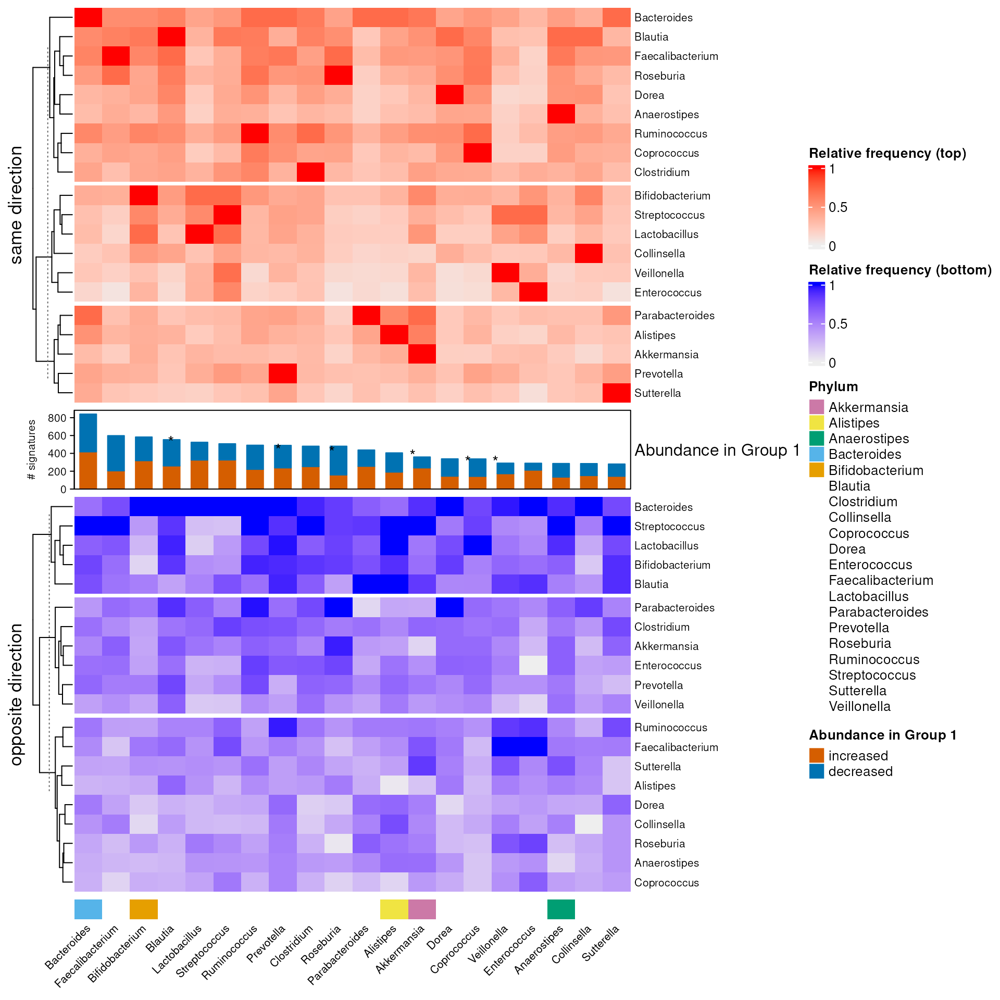

# 

## Setup

``` r

library(bugsigdbr)
library(BugSigDBStats)
library(ComplexHeatmap)
library(ggpubr)
```

## Reading data

Get bulk export from bugsigdb.org:

``` r

full.dat <- bugsigdbr::importBugSigDB(version = "devel", cache = FALSE)
dim(full.dat)
```

    ## [1] 14013    51

``` r

colnames(full.dat)
```

    ##  [1] "BSDB ID"                    "Study"                     
    ##  [3] "Study design"               "PMID"                      
    ##  [5] "DOI"                        "URL"                       
    ##  [7] "Authors list"               "Title"                     
    ##  [9] "Journal"                    "Year"                      
    ## [11] "Keywords"                   "Experiment"                
    ## [13] "Location of subjects"       "Host species"              
    ## [15] "Body site"                  "UBERON ID"                 
    ## [17] "Condition"                  "EFO ID"                    
    ## [19] "Group 0 name"               "Group 1 name"              
    ## [21] "Group 1 definition"         "Group 0 sample size"       
    ## [23] "Group 1 sample size"        "Antibiotics exclusion"     
    ## [25] "Sequencing type"            "16S variable region"       
    ## [27] "Sequencing platform"        "Data transformation"       
    ## [29] "Statistical test"           "Significance threshold"    
    ## [31] "MHT correction"             "LDA Score above"           
    ## [33] "Matched on"                 "Confounders controlled for"
    ## [35] "Pielou"                     "Shannon"                   
    ## [37] "Chao1"                      "Simpson"                   
    ## [39] "Inverse Simpson"            "Richness"                  
    ## [41] "Signature page name"        "Source"                    
    ## [43] "Curated date"               "Curator"                   
    ## [45] "Revision editor"            "Description"               
    ## [47] "Abundance in Group 1"       "MetaPhlAn taxon names"     
    ## [49] "NCBI Taxonomy IDs"          "State"                     
    ## [51] "Reviewer"

Stripping illformed entries:

``` r

is.study <- !is.na(full.dat[["Study"]])
is.exp <- !is.na(full.dat[["Experiment"]])
full.dat <- full.dat[is.study & is.exp, ]
```

## Curation output

Number of papers and signatures curated:

``` r

pmids <- unique(full.dat[,"PMID"])
length(pmids)
```

    ## [1] 2042

``` r

nrow(full.dat)
```

    ## [1] 14013

### Publication date of the curated papers:

``` r

pmids <- pmids[!is.na(pmids)]
pubyear <- pmid2pubyear(pmids)
head(cbind(pmids, pubyear))
```

``` r

tab <- table(pubyear)
tab <- tab[order(as.integer(names(tab)))]
df <- data.frame(year = names(tab), papers = as.integer(tab))
ggbarplot(df, x = "year", y = "papers", 
          label = TRUE, fill = "steelblue",
          ggtheme = theme_bw())
```

Stripping empty signatures:

``` r

ind1 <- lengths(full.dat[["MetaPhlAn taxon names"]]) > 0
ind2 <- lengths(full.dat[["NCBI Taxonomy IDs"]]) > 0
dat <- full.dat[ind1 & ind2,]
nrow(dat)
```

    ## [1] 14013

Papers containing only empty UP and DOWN signatures (under curation?):

``` r

setdiff(pmids, unique(dat[,"PMID"]))
```

    ## character(0)

### Progress over time:

``` r

dat[,"Curated date"] <- as.character(lubridate::dmy(dat[,"Curated date"]))
plotProgressOverTime(dat)
```



``` r

plotProgressOverTime(dat, diff = TRUE)
```



Stratified by curator:

``` r

npc <- stratifyByCurator(dat)
plotCuratorStats(dat, npc)
```


Number of complete and revised signatures: Turned off because it’s way
too long these days

``` r

table(dat[["State"]])
table(dat[,"Revision editor"])
```

## Study stats

### Study design

``` r

spl <- split(dat[["Study"]], dat[["Study design"]])
sds <- lapply(spl, unique)
sort(lengths(sds), decreasing = FALSE)
```

    ##              cross-sectional observational, not case-control,randomized controlled trial 
    ##                                                                                        1 
    ##                                                 laboratory experiment,prospective cohort 
    ##                                                                                        1 
    ##                                        laboratory experiment,randomized controlled trial 
    ##                                                                                        1 
    ##                                                         meta-analysis,prospective cohort 
    ##                                                                                        1 
    ##                                                 prospective cohort,laboratory experiment 
    ##                                                                                        1 
    ##                                           prospective cohort,randomized controlled trial 
    ##                                                                                        1 
    ##                                                 randomized controlled trial,case-control 
    ##                                                                                        1 
    ## time series / longitudinal observational,cross-sectional observational, not case-control 
    ##                                                                                        1 
    ##                     time series / longitudinal observational,randomized controlled trial 
    ##                                                                                        1 
    ##                                                          case-control,prospective cohort 
    ##                                                                                        2 
    ##                    cross-sectional observational, not case-control,laboratory experiment 
    ##                                                                                        2 
    ##                                                      meta-analysis,laboratory experiment 
    ##                                                                                        2 
    ##                       prospective cohort,cross-sectional observational, not case-control 
    ##                                                                                        2 
    ##                     randomized controlled trial,time series / longitudinal observational 
    ##                                                                                        2 
    ##                                    time series / longitudinal observational,case-control 
    ##                                                                                        2 
    ##                    laboratory experiment,cross-sectional observational, not case-control 
    ##                                                                                        3 
    ##                              time series / longitudinal observational,prospective cohort 
    ##                                                                                        3 
    ##                           laboratory experiment,time series / longitudinal observational 
    ##                                                                                        4 
    ##                                                               meta-analysis,case-control 
    ##                                                                                        4 
    ##                                        randomized controlled trial,laboratory experiment 
    ##                                                                                        4 
    ##                           time series / longitudinal observational,laboratory experiment 
    ##                                                                                        4 
    ##                                                               case-control,meta-analysis 
    ##                                                                                        5 
    ##                                                       laboratory experiment,case-control 
    ##                                                                                        6 
    ##                                    case-control,time series / longitudinal observational 
    ##                                                                                        7 
    ##                                                       case-control,laboratory experiment 
    ##                                                                                        8 
    ##                                                                            meta-analysis 
    ##                                                                                       31 
    ##                                                              randomized controlled trial 
    ##                                                                                       91 
    ##                                                 time series / longitudinal observational 
    ##                                                                                      154 
    ##                                                                       prospective cohort 
    ##                                                                                      160 
    ##                                                                    laboratory experiment 
    ##                                                                                      221 
    ##                                          cross-sectional observational, not case-control 
    ##                                                                                      517 
    ##                                                                             case-control 
    ##                                                                                      805

## Experiment stats

Columns of the full dataset that describe experiments:

``` r

# Experiment ID
exp.cols <- c("Study", "Experiment")

# Subjects
sub.cols <- c("Host species",    
              "Location of subjects", 
              "Body site",
              "Condition", 
              "Antibiotics exclusion",
              "Group 0 sample size",
              "Group 1 sample size")

# Lab analysis              
lab.cols <-  c("Sequencing type",
              "16S variable region",
              "Sequencing platform")

# Statistical analysis
stat.cols <-  c("Statistical test",
              "MHT correction",
              "Significance threshold")

# Alpha diversity
div.cols <- c("Pielou",
              "Shannon",
              "Chao1",
              "Simpson", 
              "Inverse Simpson",
              "Richness")
```

Restrict dataset to experiment information:

``` r

exps <- dat[,c(exp.cols, sub.cols, lab.cols, stat.cols, div.cols)]
exps <- unique(exps)
```

### Subjects

Number of experiments for the top 10 categories for each subjects
column:

``` r

sub.tab <- lapply(sub.cols[1:5], tabCol, df = exps, n = 10)
names(sub.tab) <- sub.cols[1:5]
sub.tab
```

    ## $`Host species`
    ## 
    ##           Homo sapiens           Mus musculus      Rattus norvegicus 
    ##                   6709                    931                    217 
    ##  Sus scrofa domesticus Canis lupus familiaris          Not specified 
    ##                    140                    134                     44 
    ##         Macaca mulatta             Ovis aries             Bos taurus 
    ##                     33                     28                     24 
    ##    Macaca fascicularis 
    ##                     24 
    ## 
    ## $`Location of subjects`
    ## 
    ##                    China United States of America                    Japan 
    ##                     3176                     1183                      323 
    ##              South Korea                  Germany                    Italy 
    ##                      221                      201                      193 
    ##                    Spain                  Denmark                Australia 
    ##                      190                      183                      153 
    ##                   Canada 
    ##                      137 
    ## 
    ## $`Body site`
    ## 
    ##                     Feces                    Saliva                    Vagina 
    ##                      5428                       445                       173 
    ## Subgingival dental plaque                    Caecum               Oral cavity 
    ##                       135                        93                        84 
    ##               Nasopharynx                     Mouth                     Colon 
    ##                        80                        67                        65 
    ##                    Rectum 
    ##                        56 
    ## 
    ## $Condition
    ## 
    ##                      Diet         Colorectal cancer       Parkinson's disease 
    ##                       288                       285                       235 
    ##                   Obesity                  COVID-19          Diet measurement 
    ##                       165                       127                       116 
    ##    Response to transplant          Response to diet Polycystic ovary syndrome 
    ##                       114                       106                        99 
    ## Type II diabetes mellitus 
    ##                        93 
    ## 
    ## $`Antibiotics exclusion`
    ## 
    ##                         3 months                          1 month 
    ##                             1214                              992 
    ##                         2 months                         6 months 
    ##                              365                              325 
    ##                          2 weeks                           1 week 
    ##                              252                               40 
    ##        Recent use of antibiotics         currently on antibiotics 
    ##                               37                               24 
    ##                           1 year more than 5 days during 6 months 
    ##                               22                               19

Proportions instead:

``` r

sub.tab <- lapply(sub.cols[1:5], tabCol, df = exps, n = 10, perc = TRUE)
names(sub.tab) <- sub.cols[1:5]
sub.tab
```

    ## $`Host species`
    ## 
    ##           Homo sapiens           Mus musculus      Rattus norvegicus 
    ##                0.78000                0.10800                0.02520 
    ##  Sus scrofa domesticus Canis lupus familiaris          Not specified 
    ##                0.01630                0.01560                0.00512 
    ##         Macaca mulatta             Ovis aries             Bos taurus 
    ##                0.00384                0.00326                0.00279 
    ##    Macaca fascicularis 
    ##                0.00279 
    ## 
    ## $`Location of subjects`
    ## 
    ##                    China United States of America                    Japan 
    ##                   0.3700                   0.1380                   0.0376 
    ##              South Korea                  Germany                    Italy 
    ##                   0.0257                   0.0234                   0.0225 
    ##                    Spain                  Denmark                Australia 
    ##                   0.0221                   0.0213                   0.0178 
    ##                   Canada 
    ##                   0.0159 
    ## 
    ## $`Body site`
    ## 
    ##                     Feces                    Saliva                    Vagina 
    ##                   0.63400                   0.05200                   0.02020 
    ## Subgingival dental plaque                    Caecum               Oral cavity 
    ##                   0.01580                   0.01090                   0.00982 
    ##               Nasopharynx                     Mouth                     Colon 
    ##                   0.00935                   0.00783                   0.00760 
    ##                    Rectum 
    ##                   0.00655 
    ## 
    ## $Condition
    ## 
    ##                      Diet         Colorectal cancer       Parkinson's disease 
    ##                    0.0343                    0.0339                    0.0280 
    ##                   Obesity                  COVID-19          Diet measurement 
    ##                    0.0197                    0.0151                    0.0138 
    ##    Response to transplant          Response to diet Polycystic ovary syndrome 
    ##                    0.0136                    0.0126                    0.0118 
    ## Type II diabetes mellitus 
    ##                    0.0111 
    ## 
    ## $`Antibiotics exclusion`
    ## 
    ##                         3 months                          1 month 
    ##                          0.33700                          0.27500 
    ##                         2 months                         6 months 
    ##                          0.10100                          0.09030 
    ##                          2 weeks                           1 week 
    ##                          0.07000                          0.01110 
    ##        Recent use of antibiotics         currently on antibiotics 
    ##                          0.01030                          0.00666 
    ##                           1 year more than 5 days during 6 months 
    ##                          0.00611                          0.00528

Sample size:

``` r

ssize <- apply(exps[,sub.cols[6:7]], 2, summary)
ssize
```

    ##         Group 0 sample size Group 1 sample size
    ## Min.                 0.0000             1.00000
    ## 1st Qu.             11.0000            10.00000
    ## Median              24.0000            21.00000
    ## Mean               395.0112            61.43422
    ## 3rd Qu.             49.7500            42.00000
    ## Max.            308633.0000         10413.00000
    ## NA's              1552.0000          1544.00000

### Lab analysis

Number of experiments for the top 10 categories for each lab analysis
column:

``` r

lab.tab <- lapply(lab.cols, tabCol, df = exps, n = 10)
names(lab.tab) <- lab.cols
lab.tab
```

    ## $`Sequencing type`
    ## 
    ##        16S        WMS        PCR ITS / ITS2        18S 
    ##       6732       1432         82         76          5 
    ## 
    ## $`16S variable region`
    ## 
    ##        34         4        12       123        45       345 123456789         3 
    ##      3202      1632       361       244       214       149       121        77 
    ##        56  23456789 
    ##        53        49 
    ## 
    ## $`Sequencing platform`
    ## 
    ##                              Illumina                              Roche454 
    ##                                  7032                                   339 
    ##                           Ion Torrent                               RT-qPCR 
    ##                                   293                                   156 
    ##                              Nanopore                           MGISEQ-2000 
    ##                                    72                                    56 
    ## PacBio Vega (VS)/Revio (RS)/Sequel II           Human Intestinal Tract Chip 
    ##                                    46                                    31 
    ##                             DNBSEQ-T7                 BGISEQ-500 Sequencing 
    ##                                    30                                    21

Proportions instead:

``` r

lab.tab <- lapply(lab.cols, tabCol, df = exps, n = 10, perc = TRUE)
names(lab.tab) <- lab.cols
lab.tab
```

    ## $`Sequencing type`
    ## 
    ##        16S        WMS        PCR ITS / ITS2        18S 
    ##    0.80800    0.17200    0.00985    0.00913    0.00060 
    ## 
    ## $`16S variable region`
    ## 
    ##        34         4        12       123        45       345 123456789         3 
    ##   0.51200   0.26100   0.05770   0.03900   0.03420   0.02380   0.01940   0.01230 
    ##        56  23456789 
    ##   0.00848   0.00784 
    ## 
    ## $`Sequencing platform`
    ## 
    ##                              Illumina                              Roche454 
    ##                               0.86100                               0.04150 
    ##                           Ion Torrent                               RT-qPCR 
    ##                               0.03590                               0.01910 
    ##                              Nanopore                           MGISEQ-2000 
    ##                               0.00881                               0.00685 
    ## PacBio Vega (VS)/Revio (RS)/Sequel II           Human Intestinal Tract Chip 
    ##                               0.00563                               0.00379 
    ##                             DNBSEQ-T7                 BGISEQ-500 Sequencing 
    ##                               0.00367                               0.00257

### Statistical analysis

Number of experiments for the top 10 categories for each statistical
analysis column:

``` r

# Define the columns to analyze
stat.cols <- c("Statistical test", "MHT correction", "Significance threshold")
# Get top 10 counts
stat.tab.count <- lapply(stat.cols, tabCol, df = exps, n = 10)
names(stat.tab.count) <- stat.cols
# Get top 10 proportions
stat.tab.prop <- lapply(stat.cols, tabCol, df = exps, n = 10, perc = TRUE)
names(stat.tab.prop) <- stat.cols
```

#### Top 10 Counts

``` r

count_df <- data.frame(
  Name = names(stat.tab.count[["Statistical test"]]), 
  Count = as.vector(stat.tab.count[["Statistical test"]])
)
DT::datatable(
  count_df,
  rownames = FALSE,
  options = list(pageLength = 10),
  caption = "Top categories for: Statistical test"
)
```

``` r

count_df <- data.frame(
  Name = names(stat.tab.count[["MHT correction"]]), 
  Count = as.vector(stat.tab.count[["MHT correction"]])
)
DT::datatable(
  count_df,
  rownames = FALSE,
  options = list(pageLength = 10),
  caption = "Top categories for: MHT correction"
)
```

``` r

count_df <- data.frame(
  Value = names(stat.tab.count[["Significance threshold"]]), 
  Count = as.vector(stat.tab.count[["Significance threshold"]])
)
DT::datatable(
  count_df,
  rownames = FALSE,
  options = list(pageLength = 10),
  caption = "Top categories for: Significance threshold"
)
```

#### Top 10 Proportions

``` r

prop_df <- data.frame(
  Name = names(stat.tab.prop[["Statistical test"]]), 
  Proportion = as.vector(stat.tab.prop[["Statistical test"]])
)
DT::datatable(
  prop_df,
  rownames = FALSE,
  options = list(pageLength = 10),
  caption = "Top proportions for: Statistical test"
)
```

``` r

prop_df <- data.frame(
  Name = names(stat.tab.prop[["MHT correction"]]), 
  Proportion = as.vector(stat.tab.prop[["MHT correction"]])
)
DT::datatable(
  prop_df,
  rownames = FALSE,
  options = list(pageLength = 10),
  caption = "Top proportions for: MHT correction"
)
```

``` r

prop_df <- data.frame(
  Value = names(stat.tab.prop[["Significance threshold"]]), 
  Proportion = as.vector(stat.tab.prop[["Significance threshold"]])
)
DT::datatable(
  prop_df,
  rownames = FALSE,
  options = list(pageLength = 10),
  caption = "Top proportions for: Significance threshold"
)
```

### Alpha diversity

Overall distribution:

``` r

apply(exps[,div.cols], 2, table)
```

    ##           Pielou Shannon Chao1 Simpson Inverse Simpson Richness
    ## decreased     98     949   590     343              79      610
    ## increased     64     729   431     202              60      440
    ## unchanged    328    2757  1350    1105             274     1400

Correspondence of Shannon diversity and Richness:

``` r

table(exps$Shannon, exps$Richness)
```

    ##            
    ##             decreased increased unchanged
    ##   decreased       336        15        77
    ##   increased        16       219        69
    ##   unchanged       128       117      1121

Conditions with consistently increased or decreased alpha diversity:

``` r

tabDiv(exps, "Shannon", "Condition")
```

    ##                                                           increased decreased
    ## Pulmonary tuberculosis                                            4        27
    ## Polycystic ovary syndrome                                         4        19
    ## Gastric cancer                                                    6        20
    ## COVID-19                                                         11        24
    ## Diet                                                             19        31
    ## Periodontitis                                                    15         3
    ## HIV infection                                                     1        12
    ## Ulcerative colitis                                                1        12
    ## Clostridium difficile infection                                  10         0
    ## Crohn's disease                                                   0        10
    ## Multiple sclerosis                                                2        12
    ## Obesity                                                           7        17
    ## Systemic inflammatory response syndrome                           5        15
    ## Alzheimer's disease                                               2        11
    ## Chronic constipation                                              9         0
    ## Human papilloma virus infection                                  10         1
    ## Colorectal cancer                                                19        27
    ## Gingivitis                                                        1         9
    ## Pancreatic carcinoma                                              9         1
    ## Smoking behaviour measurement                                     8         0
    ## Age                                                               6        13
    ## Dry eye syndrome                                                  1         8
    ## Heart failure                                                     0         7
    ## Lung cancer                                                       2         9
    ## Mycobacterium tuberculosis                                        7         0
    ## Atopic eczema                                                     5        11
    ## Autism spectrum disorder                                          7         1
    ## Cesarean section                                                  6         0
    ## Graves disease                                                    1         7
    ## Parkinson's disease                                              20        14
    ## Response to allogeneic hematopoietic stem cell transplant         0         6
    ## Spontaneous preterm birth                                        13         7
    ## Acute pancreatitis                                                0         5
    ## Aging                                                             2         7
    ## Bronchiectasis                                                    0         5
    ## Cervical cancer                                                   5         0
    ## Constipation                                                      8         3
    ## Epilepsy                                                          5         0
    ## Helminthiasis                                                     5         0
    ## Oxygen                                                            5         0
    ## Response to antibiotic                                            2         7
    ## Species design                                                   10        15
    ## Urinary tract infection                                           1         6
    ## Acute lymphoblastic leukemia                                      0         4
    ## Body mass index                                                   0         4
    ## Chronic kidney disease                                            2         6
    ## Chronic periodontitis                                             4         0
    ## Colitis                                                           4         0
    ## Cystic fibrosis                                                   0         4
    ## Depressive disorder                                               0         4
    ## Ethnic group                                                      3         7
    ## Food allergy                                                      6         2
    ## Gestational diabetes                                              4         0
    ## Hepatocellular carcinoma                                          4         8
    ## Human immunodeficiency virus                                      0         4
    ## Inflammatory bowel disease                                        0         4
    ## Non-alcoholic fatty liver disease                                 3         7
    ## Pregnancy                                                         4         0
    ## Type II diabetes mellitus                                         9         5
    ## Alcohol drinking                                                  3         0
    ## Antimicrobial agent                                               7        10
    ## Atopic asthma                                                     4         1
    ## Birth measurement                                                 3         0
    ## Environmental exposure measurement                                3         0
    ## Extraction protocol                                              23        26
    ## Hematopoietic stem cell                                           0         3
    ## High fat diet                                                     4         1
    ## Hypertension                                                      7         4
    ## Hypothyroidism                                                    0         3
    ## Lifestyle measurement                                             5         2
    ## Male homosexuality                                                3         0
    ## Peri-Implantitis                                                  3         0
    ## Response to antiviral drug                                        2         5
    ## SARS-CoV-2-related disease                                        0         3
    ## Schizophrenia                                                     1         4
    ## Traditional Chinese medicine type                                 2         5
    ## Tuberculosis                                                      2         5
    ## Acne                                                              0         2
    ## Age at assessment                                                 3         1
    ## Breed                                                             0         2
    ## Cervical glandular intraepithelial neoplasia                      2         0
    ## Chronic obstructive pulmonary disease                             4         2
    ## Cognitive impairment                                              1         3
    ## Compound based treatment                                          0         2
    ## Dental caries                                                     2         0
    ## Diffuse large B-cell lymphoma                                     0         2
    ## Eczema                                                            0         2
    ## Endometrial cancer                                                4         2
    ## Environmental factor                                              7         5
    ## Esophageal adenocarcinoma                                         0         2
    ## Female infertility                                                2         0
    ## Iron biomarker measurement                                        1         3
    ## Irritable bowel syndrome                                          5         7
    ## Milk allergic reaction                                            2         0
    ## Papillary thyroid carcinoma                                       2         0
    ## Phenotype                                                         2         0
    ## Phenylketonuria                                                   1         3
    ## Population                                                        5         7
    ## Reproductive behaviour measurement                                2         0
    ## Response to anti-tuberculosis drug                                8        10
    ## Response to immunochemotherapy                                    3         1
    ## Response to opioid                                                3         1
    ## Sampling site                                                     3         1
    ## Simian immunodeficiency virus infection                           0         2
    ## Sleep duration                                                    3         1
    ## Small for gestational age                                         0         2
    ## Smoking behavior                                                 10         8
    ## Smoking status measurement                                        2         0
    ## Squamous cell carcinoma                                           2         0
    ## Streptococcus pneumoniae                                          0         2
    ## Stroke                                                            2         0
    ## Acute respiratory failure                                         6         5
    ## Age-related macular degeneration                                  0         1
    ## Air pollution                                                     7         6
    ## Anxiety disorder                                                  0         1
    ## Attention deficit-hyperactivity disorder                          2         1
    ## Breast cancer                                                     4         5
    ## Breastfeeding duration                                            2         3
    ## Chronic fatigue syndrome                                          0         1
    ## Chronic hepatitis B virus infection                               0         1
    ## Clinical treatment                                                1         2
    ## Coccidiosis                                                       0         1
    ## Delivery method                                                   3         4
    ## Diarrhea                                                          3         4
    ## Endometriosis                                                     2         3
    ## Esophageal cancer                                                 1         2
    ## Esophageal squamous cell carcinoma                                1         0
    ## Estradiol measurement                                             1         2
    ## Fasting                                                           0         1
    ## Fungal infectious disease                                         2         1
    ## Glaucoma                                                          4         5
    ## Hypertrophy                                                       1         0
    ## Infant                                                            1         0
    ## Major depressive disorder                                         0         1
    ## Metastatic colorectal cancer                                      1         2
    ## Myocardial infarction                                             1         2
    ## Obstructive sleep apnea                                           0         1
    ## Oral cavity carcinoma                                             0         1
    ## Oral squamous cell carcinoma                                      3         2
    ## Ovarian cancer                                                    4         3
    ## Pneumonia                                                         1         2
    ## Prediabetes syndrome                                              0         1
    ## Premature birth                                                   1         0
    ## Prostate cancer                                                   0         1
    ## Psoriasis                                                         1         0
    ## Respiratory Syncytial Virus Infection                             0         1
    ## Respiratory tract infectious disease                              0         1
    ## Response to stress                                                1         0
    ## Response to transplant                                           10         9
    ## Response to vaccine                                               1         2
    ## Sample treatment protocol                                         1         0
    ## Sampling time                                                     4         3
    ## Social interaction measurement                                    2         1
    ## Socioeconomic status                                              3         4
    ## Stimulus or stress design                                         0         1
    ## Timepoint                                                         1         0
    ## Treatment                                                         4         3
    ## Type I diabetes mellitus                                          0         1
    ## Vesicle membrane                                                  3         2
    ## Vitiligo                                                          0         1
    ## Abnormal stool composition                                        0         0
    ## Acute myeloid leukemia                                            1         1
    ## Alcohol use disorder measurement                                  2         2
    ## Arthritis                                                         0         0
    ## Asthma                                                            3         3
    ## Biological sex                                                    1         1
    ## Bipolar disorder                                                  0         0
    ## Celiac disease                                                    0         0
    ## Chlamydia trachomatis                                             2         2
    ## Colon carcinoma                                                   0         0
    ## Colorectal adenoma                                                2         2
    ## Contraception                                                     0         0
    ## COVID-19 symptoms measurement                                     0         0
    ## Diabetes mellitus                                                 1         1
    ## Diet measurement                                                  0         0
    ## Disease progression measurement                                   0         0
    ## Exposure                                                          1         1
    ## Gastric adenocarcinoma                                            0         0
    ## Glioma                                                            0         0
    ## Head and neck squamous cell carcinoma                             0         0
    ## Health study participation                                        3         3
    ## HIV mother to child transmission                                  0         0
    ## HIV-1 infection                                                   1         1
    ## Hydroxyproline measurement                                        1         1
    ## Hypoxia                                                           4         4
    ## Ischemic stroke                                                   0         0
    ## Lactose intolerance                                               0         0
    ## Lung transplantation                                              2         2
    ## Metabolic process                                                 0         0
    ## Neurodevelopmental delay                                          0         0
    ## Obsessive-compulsive disorder                                     0         0
    ## Oral lichen planus                                                3         3
    ## Oral mucositis                                                    2         2
    ## Oxalate measurement                                               1         1
    ## Postpartum                                                        0         0
    ## Psoriasis vulgaris                                                0         0
    ## Response to diet                                                  5         5
    ## Response to dietary antigen                                       0         0
    ## Response to ketogenic diet                                        2         2
    ## Rheumatoid arthritis                                              5         5
    ## Sample collection protocol                                        0         0
    ## SARS coronavirus                                                  0         0
    ## Social deprivation,Psychological measurement                      0         0
    ## Transplant outcome measurement                                    0         0
    ## Viral load                                                        0         0
    ## Waist circumference                                               0         0
    ##                                                           unchanged
    ## Pulmonary tuberculosis                                           20
    ## Polycystic ovary syndrome                                        30
    ## Gastric cancer                                                   27
    ## COVID-19                                                         50
    ## Diet                                                             83
    ## Periodontitis                                                    16
    ## HIV infection                                                    27
    ## Ulcerative colitis                                                5
    ## Clostridium difficile infection                                   1
    ## Crohn's disease                                                  11
    ## Multiple sclerosis                                               32
    ## Obesity                                                          70
    ## Systemic inflammatory response syndrome                           4
    ## Alzheimer's disease                                              30
    ## Chronic constipation                                             12
    ## Human papilloma virus infection                                  28
    ## Colorectal cancer                                                91
    ## Gingivitis                                                       12
    ## Pancreatic carcinoma                                              6
    ## Smoking behaviour measurement                                     9
    ## Age                                                              11
    ## Dry eye syndrome                                                 14
    ## Heart failure                                                     2
    ## Lung cancer                                                       8
    ## Mycobacterium tuberculosis                                        5
    ## Atopic eczema                                                    72
    ## Autism spectrum disorder                                         12
    ## Cesarean section                                                 16
    ## Graves disease                                                    7
    ## Parkinson's disease                                              95
    ## Response to allogeneic hematopoietic stem cell transplant         0
    ## Spontaneous preterm birth                                         6
    ## Acute pancreatitis                                                3
    ## Aging                                                             2
    ## Bronchiectasis                                                    0
    ## Cervical cancer                                                   6
    ## Constipation                                                     13
    ## Epilepsy                                                          5
    ## Helminthiasis                                                     8
    ## Oxygen                                                            0
    ## Response to antibiotic                                           23
    ## Species design                                                   16
    ## Urinary tract infection                                          11
    ## Acute lymphoblastic leukemia                                     10
    ## Body mass index                                                   2
    ## Chronic kidney disease                                           11
    ## Chronic periodontitis                                             8
    ## Colitis                                                           2
    ## Cystic fibrosis                                                   3
    ## Depressive disorder                                               7
    ## Ethnic group                                                      6
    ## Food allergy                                                     19
    ## Gestational diabetes                                             37
    ## Hepatocellular carcinoma                                          7
    ## Human immunodeficiency virus                                      6
    ## Inflammatory bowel disease                                        1
    ## Non-alcoholic fatty liver disease                                13
    ## Pregnancy                                                         9
    ## Type II diabetes mellitus                                        42
    ## Alcohol drinking                                                  2
    ## Antimicrobial agent                                              25
    ## Atopic asthma                                                     7
    ## Birth measurement                                                 4
    ## Environmental exposure measurement                                4
    ## Extraction protocol                                              21
    ## Hematopoietic stem cell                                           3
    ## High fat diet                                                     2
    ## Hypertension                                                      8
    ## Hypothyroidism                                                    4
    ## Lifestyle measurement                                            14
    ## Male homosexuality                                                6
    ## Peri-Implantitis                                                  2
    ## Response to antiviral drug                                       17
    ## SARS-CoV-2-related disease                                        5
    ## Schizophrenia                                                    24
    ## Traditional Chinese medicine type                                 8
    ## Tuberculosis                                                      0
    ## Acne                                                              3
    ## Age at assessment                                                 1
    ## Breed                                                             7
    ## Cervical glandular intraepithelial neoplasia                      9
    ## Chronic obstructive pulmonary disease                             5
    ## Cognitive impairment                                             14
    ## Compound based treatment                                          5
    ## Dental caries                                                     4
    ## Diffuse large B-cell lymphoma                                     3
    ## Eczema                                                           10
    ## Endometrial cancer                                                3
    ## Environmental factor                                             18
    ## Esophageal adenocarcinoma                                         4
    ## Female infertility                                                3
    ## Iron biomarker measurement                                        2
    ## Irritable bowel syndrome                                         28
    ## Milk allergic reaction                                            5
    ## Papillary thyroid carcinoma                                      10
    ## Phenotype                                                        19
    ## Phenylketonuria                                                   4
    ## Population                                                       28
    ## Reproductive behaviour measurement                                3
    ## Response to anti-tuberculosis drug                               13
    ## Response to immunochemotherapy                                    3
    ## Response to opioid                                                2
    ## Sampling site                                                     7
    ## Simian immunodeficiency virus infection                           9
    ## Sleep duration                                                    2
    ## Small for gestational age                                         6
    ## Smoking behavior                                                 26
    ## Smoking status measurement                                        4
    ## Squamous cell carcinoma                                           4
    ## Streptococcus pneumoniae                                          4
    ## Stroke                                                           16
    ## Acute respiratory failure                                         0
    ## Age-related macular degeneration                                  4
    ## Air pollution                                                     3
    ## Anxiety disorder                                                  7
    ## Attention deficit-hyperactivity disorder                          6
    ## Breast cancer                                                    31
    ## Breastfeeding duration                                            5
    ## Chronic fatigue syndrome                                          4
    ## Chronic hepatitis B virus infection                               5
    ## Clinical treatment                                               11
    ## Coccidiosis                                                       4
    ## Delivery method                                                  12
    ## Diarrhea                                                          7
    ## Endometriosis                                                    14
    ## Esophageal cancer                                                 2
    ## Esophageal squamous cell carcinoma                                5
    ## Estradiol measurement                                             2
    ## Fasting                                                           4
    ## Fungal infectious disease                                         4
    ## Glaucoma                                                          6
    ## Hypertrophy                                                       4
    ## Infant                                                            4
    ## Major depressive disorder                                         6
    ## Metastatic colorectal cancer                                      3
    ## Myocardial infarction                                             8
    ## Obstructive sleep apnea                                          11
    ## Oral cavity carcinoma                                             7
    ## Oral squamous cell carcinoma                                      3
    ## Ovarian cancer                                                   35
    ## Pneumonia                                                         3
    ## Prediabetes syndrome                                              4
    ## Premature birth                                                   6
    ## Prostate cancer                                                   9
    ## Psoriasis                                                        14
    ## Respiratory Syncytial Virus Infection                             5
    ## Respiratory tract infectious disease                              5
    ## Response to stress                                                9
    ## Response to transplant                                           34
    ## Response to vaccine                                               5
    ## Sample treatment protocol                                         4
    ## Sampling time                                                     7
    ## Social interaction measurement                                    6
    ## Socioeconomic status                                              8
    ## Stimulus or stress design                                         4
    ## Timepoint                                                         5
    ## Treatment                                                         5
    ## Type I diabetes mellitus                                         10
    ## Vesicle membrane                                                  1
    ## Vitiligo                                                          4
    ## Abnormal stool composition                                        6
    ## Acute myeloid leukemia                                            7
    ## Alcohol use disorder measurement                                  4
    ## Arthritis                                                         6
    ## Asthma                                                           17
    ## Biological sex                                                    6
    ## Bipolar disorder                                                  5
    ## Celiac disease                                                    6
    ## Chlamydia trachomatis                                             2
    ## Colon carcinoma                                                   8
    ## Colorectal adenoma                                               10
    ## Contraception                                                     5
    ## COVID-19 symptoms measurement                                     5
    ## Diabetes mellitus                                                 9
    ## Diet measurement                                                 60
    ## Disease progression measurement                                   5
    ## Exposure                                                          4
    ## Gastric adenocarcinoma                                            8
    ## Glioma                                                            5
    ## Head and neck squamous cell carcinoma                             8
    ## Health study participation                                       36
    ## HIV mother to child transmission                                  8
    ## HIV-1 infection                                                   3
    ## Hydroxyproline measurement                                        3
    ## Hypoxia                                                           0
    ## Ischemic stroke                                                   5
    ## Lactose intolerance                                               5
    ## Lung transplantation                                              2
    ## Metabolic process                                                 7
    ## Neurodevelopmental delay                                          6
    ## Obsessive-compulsive disorder                                     5
    ## Oral lichen planus                                                4
    ## Oral mucositis                                                    3
    ## Oxalate measurement                                               8
    ## Postpartum                                                        5
    ## Psoriasis vulgaris                                               14
    ## Response to diet                                                 46
    ## Response to dietary antigen                                       6
    ## Response to ketogenic diet                                        3
    ## Rheumatoid arthritis                                             15
    ## Sample collection protocol                                        9
    ## SARS coronavirus                                                  6
    ## Social deprivation,Psychological measurement                     12
    ## Transplant outcome measurement                                   11
    ## Viral load                                                        6
    ## Waist circumference                                               5

``` r

tabDiv(exps, "Shannon", "Condition", perc = TRUE)
```

    ##                                                           increased decreased
    ## Pulmonary tuberculosis                                        0.078     0.530
    ## Polycystic ovary syndrome                                     0.075     0.360
    ## Gastric cancer                                                0.110     0.380
    ## COVID-19                                                      0.130     0.280
    ## Diet                                                          0.140     0.230
    ## Periodontitis                                                 0.440     0.088
    ## HIV infection                                                 0.025     0.300
    ## Ulcerative colitis                                            0.056     0.670
    ## Clostridium difficile infection                               0.910     0.000
    ## Crohn's disease                                               0.000     0.480
    ## Multiple sclerosis                                            0.043     0.260
    ## Obesity                                                       0.074     0.180
    ## Systemic inflammatory response syndrome                       0.210     0.620
    ## Alzheimer's disease                                           0.047     0.260
    ## Chronic constipation                                          0.430     0.000
    ## Human papilloma virus infection                               0.260     0.026
    ## Colorectal cancer                                             0.140     0.200
    ## Gingivitis                                                    0.045     0.410
    ## Pancreatic carcinoma                                          0.560     0.062
    ## Smoking behaviour measurement                                 0.470     0.000
    ## Age                                                           0.200     0.430
    ## Dry eye syndrome                                              0.043     0.350
    ## Heart failure                                                 0.000     0.780
    ## Lung cancer                                                   0.110     0.470
    ## Mycobacterium tuberculosis                                    0.580     0.000
    ## Atopic eczema                                                 0.057     0.120
    ## Autism spectrum disorder                                      0.350     0.050
    ## Cesarean section                                              0.270     0.000
    ## Graves disease                                                0.067     0.470
    ## Parkinson's disease                                           0.160     0.110
    ## Response to allogeneic hematopoietic stem cell transplant     0.000     1.000
    ## Spontaneous preterm birth                                     0.500     0.270
    ## Acute pancreatitis                                            0.000     0.620
    ## Aging                                                         0.180     0.640
    ## Bronchiectasis                                                0.000     1.000
    ## Cervical cancer                                               0.450     0.000
    ## Constipation                                                  0.330     0.120
    ## Epilepsy                                                      0.500     0.000
    ## Helminthiasis                                                 0.380     0.000
    ## Oxygen                                                        1.000     0.000
    ## Response to antibiotic                                        0.062     0.220
    ## Species design                                                0.240     0.370
    ## Urinary tract infection                                       0.056     0.330
    ## Acute lymphoblastic leukemia                                  0.000     0.290
    ## Body mass index                                               0.000     0.670
    ## Chronic kidney disease                                        0.110     0.320
    ## Chronic periodontitis                                         0.330     0.000
    ## Colitis                                                       0.670     0.000
    ## Cystic fibrosis                                               0.000     0.570
    ## Depressive disorder                                           0.000     0.360
    ## Ethnic group                                                  0.190     0.440
    ## Food allergy                                                  0.220     0.074
    ## Gestational diabetes                                          0.098     0.000
    ## Hepatocellular carcinoma                                      0.210     0.420
    ## Human immunodeficiency virus                                  0.000     0.400
    ## Inflammatory bowel disease                                    0.000     0.800
    ## Non-alcoholic fatty liver disease                             0.130     0.300
    ## Pregnancy                                                     0.310     0.000
    ## Type II diabetes mellitus                                     0.160     0.089
    ## Alcohol drinking                                              0.600     0.000
    ## Antimicrobial agent                                           0.170     0.240
    ## Atopic asthma                                                 0.330     0.083
    ## Birth measurement                                             0.430     0.000
    ## Environmental exposure measurement                            0.430     0.000
    ## Extraction protocol                                           0.330     0.370
    ## Hematopoietic stem cell                                       0.000     0.500
    ## High fat diet                                                 0.570     0.140
    ## Hypertension                                                  0.370     0.210
    ## Hypothyroidism                                                0.000     0.430
    ## Lifestyle measurement                                         0.240     0.095
    ## Male homosexuality                                            0.330     0.000
    ## Peri-Implantitis                                              0.600     0.000
    ## Response to antiviral drug                                    0.083     0.210
    ## SARS-CoV-2-related disease                                    0.000     0.380
    ## Schizophrenia                                                 0.034     0.140
    ## Traditional Chinese medicine type                             0.130     0.330
    ## Tuberculosis                                                  0.290     0.710
    ## Acne                                                          0.000     0.400
    ## Age at assessment                                             0.600     0.200
    ## Breed                                                         0.000     0.220
    ## Cervical glandular intraepithelial neoplasia                  0.180     0.000
    ## Chronic obstructive pulmonary disease                         0.360     0.180
    ## Cognitive impairment                                          0.056     0.170
    ## Compound based treatment                                      0.000     0.290
    ## Dental caries                                                 0.330     0.000
    ## Diffuse large B-cell lymphoma                                 0.000     0.400
    ## Eczema                                                        0.000     0.170
    ## Endometrial cancer                                            0.440     0.220
    ## Environmental factor                                          0.230     0.170
    ## Esophageal adenocarcinoma                                     0.000     0.330
    ## Female infertility                                            0.400     0.000
    ## Iron biomarker measurement                                    0.170     0.500
    ## Irritable bowel syndrome                                      0.120     0.180
    ## Milk allergic reaction                                        0.290     0.000
    ## Papillary thyroid carcinoma                                   0.170     0.000
    ## Phenotype                                                     0.095     0.000
    ## Phenylketonuria                                               0.120     0.380
    ## Population                                                    0.120     0.180
    ## Reproductive behaviour measurement                            0.400     0.000
    ## Response to anti-tuberculosis drug                            0.260     0.320
    ## Response to immunochemotherapy                                0.430     0.140
    ## Response to opioid                                            0.500     0.170
    ## Sampling site                                                 0.270     0.091
    ## Simian immunodeficiency virus infection                       0.000     0.180
    ## Sleep duration                                                0.500     0.170
    ## Small for gestational age                                     0.000     0.250
    ## Smoking behavior                                              0.230     0.180
    ## Smoking status measurement                                    0.330     0.000
    ## Squamous cell carcinoma                                       0.330     0.000
    ## Streptococcus pneumoniae                                      0.000     0.330
    ## Stroke                                                        0.110     0.000
    ## Acute respiratory failure                                     0.550     0.450
    ## Age-related macular degeneration                              0.000     0.200
    ## Air pollution                                                 0.440     0.380
    ## Anxiety disorder                                              0.000     0.120
    ## Attention deficit-hyperactivity disorder                      0.220     0.110
    ## Breast cancer                                                 0.100     0.120
    ## Breastfeeding duration                                        0.200     0.300
    ## Chronic fatigue syndrome                                      0.000     0.200
    ## Chronic hepatitis B virus infection                           0.000     0.170
    ## Clinical treatment                                            0.071     0.140
    ## Coccidiosis                                                   0.000     0.200
    ## Delivery method                                               0.160     0.210
    ## Diarrhea                                                      0.210     0.290
    ## Endometriosis                                                 0.110     0.160
    ## Esophageal cancer                                             0.200     0.400
    ## Esophageal squamous cell carcinoma                            0.170     0.000
    ## Estradiol measurement                                         0.200     0.400
    ## Fasting                                                       0.000     0.200
    ## Fungal infectious disease                                     0.290     0.140
    ## Glaucoma                                                      0.270     0.330
    ## Hypertrophy                                                   0.200     0.000
    ## Infant                                                        0.200     0.000
    ## Major depressive disorder                                     0.000     0.140
    ## Metastatic colorectal cancer                                  0.170     0.330
    ## Myocardial infarction                                         0.091     0.180
    ## Obstructive sleep apnea                                       0.000     0.083
    ## Oral cavity carcinoma                                         0.000     0.120
    ## Oral squamous cell carcinoma                                  0.380     0.250
    ## Ovarian cancer                                                0.095     0.071
    ## Pneumonia                                                     0.170     0.330
    ## Prediabetes syndrome                                          0.000     0.200
    ## Premature birth                                               0.140     0.000
    ## Prostate cancer                                               0.000     0.100
    ## Psoriasis                                                     0.067     0.000
    ## Respiratory Syncytial Virus Infection                         0.000     0.170
    ## Respiratory tract infectious disease                          0.000     0.170
    ## Response to stress                                            0.100     0.000
    ## Response to transplant                                        0.190     0.170
    ## Response to vaccine                                           0.120     0.250
    ## Sample treatment protocol                                     0.200     0.000
    ## Sampling time                                                 0.290     0.210
    ## Social interaction measurement                                0.220     0.110
    ## Socioeconomic status                                          0.200     0.270
    ## Stimulus or stress design                                     0.000     0.200
    ## Timepoint                                                     0.170     0.000
    ## Treatment                                                     0.330     0.250
    ## Type I diabetes mellitus                                      0.000     0.091
    ## Vesicle membrane                                              0.500     0.330
    ## Vitiligo                                                      0.000     0.200
    ## Abnormal stool composition                                    0.000     0.000
    ## Acute myeloid leukemia                                        0.110     0.110
    ## Alcohol use disorder measurement                              0.250     0.250
    ## Arthritis                                                     0.000     0.000
    ## Asthma                                                        0.130     0.130
    ## Biological sex                                                0.120     0.120
    ## Bipolar disorder                                              0.000     0.000
    ## Celiac disease                                                0.000     0.000
    ## Chlamydia trachomatis                                         0.330     0.330
    ## Colon carcinoma                                               0.000     0.000
    ## Colorectal adenoma                                            0.140     0.140
    ## Contraception                                                 0.000     0.000
    ## COVID-19 symptoms measurement                                 0.000     0.000
    ## Diabetes mellitus                                             0.091     0.091
    ## Diet measurement                                              0.000     0.000
    ## Disease progression measurement                               0.000     0.000
    ## Exposure                                                      0.170     0.170
    ## Gastric adenocarcinoma                                        0.000     0.000
    ## Glioma                                                        0.000     0.000
    ## Head and neck squamous cell carcinoma                         0.000     0.000
    ## Health study participation                                    0.071     0.071
    ## HIV mother to child transmission                              0.000     0.000
    ## HIV-1 infection                                               0.200     0.200
    ## Hydroxyproline measurement                                    0.200     0.200
    ## Hypoxia                                                       0.500     0.500
    ## Ischemic stroke                                               0.000     0.000
    ## Lactose intolerance                                           0.000     0.000
    ## Lung transplantation                                          0.330     0.330
    ## Metabolic process                                             0.000     0.000
    ## Neurodevelopmental delay                                      0.000     0.000
    ## Obsessive-compulsive disorder                                 0.000     0.000
    ## Oral lichen planus                                            0.300     0.300
    ## Oral mucositis                                                0.290     0.290
    ## Oxalate measurement                                           0.100     0.100
    ## Postpartum                                                    0.000     0.000
    ## Psoriasis vulgaris                                            0.000     0.000
    ## Response to diet                                              0.089     0.089
    ## Response to dietary antigen                                   0.000     0.000
    ## Response to ketogenic diet                                    0.290     0.290
    ## Rheumatoid arthritis                                          0.200     0.200
    ## Sample collection protocol                                    0.000     0.000
    ## SARS coronavirus                                              0.000     0.000
    ## Social deprivation,Psychological measurement                  0.000     0.000
    ## Transplant outcome measurement                                0.000     0.000
    ## Viral load                                                    0.000     0.000
    ## Waist circumference                                           0.000     0.000
    ##                                                           unchanged
    ## Pulmonary tuberculosis                                        0.390
    ## Polycystic ovary syndrome                                     0.570
    ## Gastric cancer                                                0.510
    ## COVID-19                                                      0.590
    ## Diet                                                          0.620
    ## Periodontitis                                                 0.470
    ## HIV infection                                                 0.680
    ## Ulcerative colitis                                            0.280
    ## Clostridium difficile infection                               0.091
    ## Crohn's disease                                               0.520
    ## Multiple sclerosis                                            0.700
    ## Obesity                                                       0.740
    ## Systemic inflammatory response syndrome                       0.170
    ## Alzheimer's disease                                           0.700
    ## Chronic constipation                                          0.570
    ## Human papilloma virus infection                               0.720
    ## Colorectal cancer                                             0.660
    ## Gingivitis                                                    0.550
    ## Pancreatic carcinoma                                          0.380
    ## Smoking behaviour measurement                                 0.530
    ## Age                                                           0.370
    ## Dry eye syndrome                                              0.610
    ## Heart failure                                                 0.220
    ## Lung cancer                                                   0.420
    ## Mycobacterium tuberculosis                                    0.420
    ## Atopic eczema                                                 0.820
    ## Autism spectrum disorder                                      0.600
    ## Cesarean section                                              0.730
    ## Graves disease                                                0.470
    ## Parkinson's disease                                           0.740
    ## Response to allogeneic hematopoietic stem cell transplant     0.000
    ## Spontaneous preterm birth                                     0.230
    ## Acute pancreatitis                                            0.380
    ## Aging                                                         0.180
    ## Bronchiectasis                                                0.000
    ## Cervical cancer                                               0.550
    ## Constipation                                                  0.540
    ## Epilepsy                                                      0.500
    ## Helminthiasis                                                 0.620
    ## Oxygen                                                        0.000
    ## Response to antibiotic                                        0.720
    ## Species design                                                0.390
    ## Urinary tract infection                                       0.610
    ## Acute lymphoblastic leukemia                                  0.710
    ## Body mass index                                               0.330
    ## Chronic kidney disease                                        0.580
    ## Chronic periodontitis                                         0.670
    ## Colitis                                                       0.330
    ## Cystic fibrosis                                               0.430
    ## Depressive disorder                                           0.640
    ## Ethnic group                                                  0.380
    ## Food allergy                                                  0.700
    ## Gestational diabetes                                          0.900
    ## Hepatocellular carcinoma                                      0.370
    ## Human immunodeficiency virus                                  0.600
    ## Inflammatory bowel disease                                    0.200
    ## Non-alcoholic fatty liver disease                             0.570
    ## Pregnancy                                                     0.690
    ## Type II diabetes mellitus                                     0.750
    ## Alcohol drinking                                              0.400
    ## Antimicrobial agent                                           0.600
    ## Atopic asthma                                                 0.580
    ## Birth measurement                                             0.570
    ## Environmental exposure measurement                            0.570
    ## Extraction protocol                                           0.300
    ## Hematopoietic stem cell                                       0.500
    ## High fat diet                                                 0.290
    ## Hypertension                                                  0.420
    ## Hypothyroidism                                                0.570
    ## Lifestyle measurement                                         0.670
    ## Male homosexuality                                            0.670
    ## Peri-Implantitis                                              0.400
    ## Response to antiviral drug                                    0.710
    ## SARS-CoV-2-related disease                                    0.620
    ## Schizophrenia                                                 0.830
    ## Traditional Chinese medicine type                             0.530
    ## Tuberculosis                                                  0.000
    ## Acne                                                          0.600
    ## Age at assessment                                             0.200
    ## Breed                                                         0.780
    ## Cervical glandular intraepithelial neoplasia                  0.820
    ## Chronic obstructive pulmonary disease                         0.450
    ## Cognitive impairment                                          0.780
    ## Compound based treatment                                      0.710
    ## Dental caries                                                 0.670
    ## Diffuse large B-cell lymphoma                                 0.600
    ## Eczema                                                        0.830
    ## Endometrial cancer                                            0.330
    ## Environmental factor                                          0.600
    ## Esophageal adenocarcinoma                                     0.670
    ## Female infertility                                            0.600
    ## Iron biomarker measurement                                    0.330
    ## Irritable bowel syndrome                                      0.700
    ## Milk allergic reaction                                        0.710
    ## Papillary thyroid carcinoma                                   0.830
    ## Phenotype                                                     0.900
    ## Phenylketonuria                                               0.500
    ## Population                                                    0.700
    ## Reproductive behaviour measurement                            0.600
    ## Response to anti-tuberculosis drug                            0.420
    ## Response to immunochemotherapy                                0.430
    ## Response to opioid                                            0.330
    ## Sampling site                                                 0.640
    ## Simian immunodeficiency virus infection                       0.820
    ## Sleep duration                                                0.330
    ## Small for gestational age                                     0.750
    ## Smoking behavior                                              0.590
    ## Smoking status measurement                                    0.670
    ## Squamous cell carcinoma                                       0.670
    ## Streptococcus pneumoniae                                      0.670
    ## Stroke                                                        0.890
    ## Acute respiratory failure                                     0.000
    ## Age-related macular degeneration                              0.800
    ## Air pollution                                                 0.190
    ## Anxiety disorder                                              0.880
    ## Attention deficit-hyperactivity disorder                      0.670
    ## Breast cancer                                                 0.780
    ## Breastfeeding duration                                        0.500
    ## Chronic fatigue syndrome                                      0.800
    ## Chronic hepatitis B virus infection                           0.830
    ## Clinical treatment                                            0.790
    ## Coccidiosis                                                   0.800
    ## Delivery method                                               0.630
    ## Diarrhea                                                      0.500
    ## Endometriosis                                                 0.740
    ## Esophageal cancer                                             0.400
    ## Esophageal squamous cell carcinoma                            0.830
    ## Estradiol measurement                                         0.400
    ## Fasting                                                       0.800
    ## Fungal infectious disease                                     0.570
    ## Glaucoma                                                      0.400
    ## Hypertrophy                                                   0.800
    ## Infant                                                        0.800
    ## Major depressive disorder                                     0.860
    ## Metastatic colorectal cancer                                  0.500
    ## Myocardial infarction                                         0.730
    ## Obstructive sleep apnea                                       0.920
    ## Oral cavity carcinoma                                         0.880
    ## Oral squamous cell carcinoma                                  0.380
    ## Ovarian cancer                                                0.830
    ## Pneumonia                                                     0.500
    ## Prediabetes syndrome                                          0.800
    ## Premature birth                                               0.860
    ## Prostate cancer                                               0.900
    ## Psoriasis                                                     0.930
    ## Respiratory Syncytial Virus Infection                         0.830
    ## Respiratory tract infectious disease                          0.830
    ## Response to stress                                            0.900
    ## Response to transplant                                        0.640
    ## Response to vaccine                                           0.620
    ## Sample treatment protocol                                     0.800
    ## Sampling time                                                 0.500
    ## Social interaction measurement                                0.670
    ## Socioeconomic status                                          0.530
    ## Stimulus or stress design                                     0.800
    ## Timepoint                                                     0.830
    ## Treatment                                                     0.420
    ## Type I diabetes mellitus                                      0.910
    ## Vesicle membrane                                              0.170
    ## Vitiligo                                                      0.800
    ## Abnormal stool composition                                    1.000
    ## Acute myeloid leukemia                                        0.780
    ## Alcohol use disorder measurement                              0.500
    ## Arthritis                                                     1.000
    ## Asthma                                                        0.740
    ## Biological sex                                                0.750
    ## Bipolar disorder                                              1.000
    ## Celiac disease                                                1.000
    ## Chlamydia trachomatis                                         0.330
    ## Colon carcinoma                                               1.000
    ## Colorectal adenoma                                            0.710
    ## Contraception                                                 1.000
    ## COVID-19 symptoms measurement                                 1.000
    ## Diabetes mellitus                                             0.820
    ## Diet measurement                                              1.000
    ## Disease progression measurement                               1.000
    ## Exposure                                                      0.670
    ## Gastric adenocarcinoma                                        1.000
    ## Glioma                                                        1.000
    ## Head and neck squamous cell carcinoma                         1.000
    ## Health study participation                                    0.860
    ## HIV mother to child transmission                              1.000
    ## HIV-1 infection                                               0.600
    ## Hydroxyproline measurement                                    0.600
    ## Hypoxia                                                       0.000
    ## Ischemic stroke                                               1.000
    ## Lactose intolerance                                           1.000
    ## Lung transplantation                                          0.330
    ## Metabolic process                                             1.000
    ## Neurodevelopmental delay                                      1.000
    ## Obsessive-compulsive disorder                                 1.000
    ## Oral lichen planus                                            0.400
    ## Oral mucositis                                                0.430
    ## Oxalate measurement                                           0.800
    ## Postpartum                                                    1.000
    ## Psoriasis vulgaris                                            1.000
    ## Response to diet                                              0.820
    ## Response to dietary antigen                                   1.000
    ## Response to ketogenic diet                                    0.430
    ## Rheumatoid arthritis                                          0.600
    ## Sample collection protocol                                    1.000
    ## SARS coronavirus                                              1.000
    ## Social deprivation,Psychological measurement                  1.000
    ## Transplant outcome measurement                                1.000
    ## Viral load                                                    1.000
    ## Waist circumference                                           1.000

``` r

tabDiv(exps, "Richness", "Condition")
```

    ##                                                           increased decreased
    ## Diet                                                              6        20
    ## Helminthiasis                                                    13         0
    ## HIV infection                                                     3        15
    ## Multiple sclerosis                                                2        14
    ## Pulmonary tuberculosis                                            6        18
    ## Periodontitis                                                    14         3
    ## Polycystic ovary syndrome                                         5        16
    ## COVID-19                                                         11        20
    ## Parkinson's disease                                              19        27
    ## Phenotype                                                         9         1
    ## Small for gestational age                                         0         8
    ## Aging                                                             0         7
    ## Chronic constipation                                              7         0
    ## Gastric cancer                                                    5        12
    ## Gingivitis                                                        1         8
    ## Species design                                                   10        17
    ## Chronic kidney disease                                            0         6
    ## Increased intestinal transit time                                 6         0
    ## Response to allogeneic hematopoietic stem cell transplant         0         6
    ## Schizophrenia                                                     1         7
    ## Alcohol drinking                                                  5         0
    ## Antimicrobial agent                                               2         7
    ## Environmental factor                                              0         5
    ## Human immunodeficiency virus                                      1         6
    ## Human papilloma virus infection                                   7         2
    ## Acute lymphoblastic leukemia                                      5         1
    ## Air pollution                                                     9         5
    ## Cervical glandular intraepithelial neoplasia                      4         0
    ## Crohn's disease                                                   2         6
    ## Diarrhea                                                          5         1
    ## Dry eye syndrome                                                  0         4
    ## Epilepsy                                                          4         0
    ## Fungal infectious disease                                         0         4
    ## Major depressive disorder                                         4         0
    ## Stress-related disorder                                           0         4
    ## Ulcerative colitis                                                0         4
    ## Vesicle membrane                                                  5         1
    ## Alzheimer's disease                                               8         5
    ## Atopic asthma                                                     4         1
    ## Delivery method                                                   4         1
    ## Depressive disorder                                               0         3
    ## Endometriosis                                                     4         1
    ## Food allergy                                                      0         3
    ## Graves disease                                                    2         5
    ## Hematopoietic stem cell                                           0         3
    ## Hypertension                                                      1         4
    ## Hypertrophy                                                       3         0
    ## Iron biomarker measurement                                        1         4
    ## Oral squamous cell carcinoma                                      1         4
    ## Response to diet                                                  3         6
    ## Treatment                                                         4         7
    ## Tuberculosis                                                      2         5
    ## Acute myeloid leukemia                                            0         2
    ## Alcohol use disorder measurement                                  2         0
    ## Bone mineral content measurement                                  0         2
    ## Breast cancer                                                     2         0
    ## Cognitive impairment                                              0         2
    ## Colorectal cancer                                                18        20
    ## Esophageal adenocarcinoma                                         0         2
    ## Gestational diabetes                                              4         6
    ## Health study participation                                        2         0
    ## Hypothyroidism                                                    0         2
    ## Inflammatory bowel disease                                        2         4
    ## Irritable bowel syndrome                                          5         7
    ## Lifestyle measurement                                             4         2
    ## Lung cancer                                                       0         2
    ## Metabolic process                                                 0         2
    ## Obesity                                                          10         8
    ## Phenylketonuria                                                   1         3
    ## Population                                                        2         0
    ## Response to antibiotic                                            0         2
    ## Response to antiviral drug                                        0         2
    ## Simian immunodeficiency virus infection                           0         2
    ## Smoking behavior                                                  6         8
    ## Smoking behaviour measurement                                     2         0
    ## Smoking status measurement                                        2         0
    ## Streptococcus pneumoniae                                          0         2
    ## Traditional Chinese medicine type                                 1         3
    ## Transplant outcome measurement                                    0         2
    ## Type II diabetes mellitus                                         6         4
    ## Age                                                               4         5
    ## Asthma                                                            2         3
    ## Atopic eczema                                                     2         1
    ## Autism spectrum disorder                                          5         6
    ## Bone density                                                      0         1
    ## Breastfeeding duration                                            1         0
    ## Cesarean section                                                  3         2
    ## Chronic periodontitis                                             1         0
    ## Coccidiosis                                                       0         1
    ## Colon carcinoma                                                   0         1
    ## Colorectal adenoma                                                1         2
    ## Endometrial cancer                                                1         2
    ## Heart failure                                                     2         3
    ## Infant                                                            1         0
    ## Ischemic stroke                                                   2         1
    ## Neurodevelopmental delay                                          1         0
    ## Non-alcoholic fatty liver disease                                 0         1
    ## Obsessive-compulsive disorder                                     0         1
    ## Ovarian cancer                                                    1         0
    ## Pregnancy                                                         1         0
    ## Psoriasis                                                         0         1
    ## Reproductive behaviour measurement                                1         0
    ## Response to stress                                                1         0
    ## Response to transplant                                            9         8
    ## Rheumatoid arthritis                                              3         4
    ## Sampling site                                                     1         2
    ## Socioeconomic status                                              2         1
    ## Transport                                                         1         2
    ## Type I diabetes mellitus                                          0         1
    ## Abnormal stool composition                                        0         0
    ## Attention deficit-hyperactivity disorder                          0         0
    ## Chlamydia trachomatis                                             1         1
    ## Constipation                                                      7         7
    ## Diabetes mellitus                                                 0         0
    ## Diet measurement                                                  0         0
    ## Ethnic group                                                      2         2
    ## Glioma                                                            1         1
    ## Head and neck squamous cell carcinoma                             0         0
    ## Hepatocellular carcinoma                                          3         3
    ## HIV mother to child transmission                                  0         0
    ## Male homosexuality                                                0         0
    ## Myocardial infarction                                             0         0
    ## Papillary thyroid carcinoma                                       0         0
    ## Physical activity                                                 2         2
    ## Prostate cancer                                                   0         0
    ## Psoriasis vulgaris                                                0         0
    ## Sample collection protocol                                        0         0
    ## Stroke                                                            2         2
    ## Urinary tract infection                                           1         1
    ## Viral load                                                        0         0
    ##                                                           unchanged
    ## Diet                                                             34
    ## Helminthiasis                                                     0
    ## HIV infection                                                    10
    ## Multiple sclerosis                                               29
    ## Pulmonary tuberculosis                                            9
    ## Periodontitis                                                    23
    ## Polycystic ovary syndrome                                        16
    ## COVID-19                                                         25
    ## Parkinson's disease                                              33
    ## Phenotype                                                        11
    ## Small for gestational age                                         0
    ## Aging                                                             1
    ## Chronic constipation                                              7
    ## Gastric cancer                                                   14
    ## Gingivitis                                                       14
    ## Species design                                                   14
    ## Chronic kidney disease                                            7
    ## Increased intestinal transit time                                 0
    ## Response to allogeneic hematopoietic stem cell transplant         0
    ## Schizophrenia                                                    14
    ## Alcohol drinking                                                  0
    ## Antimicrobial agent                                              10
    ## Environmental factor                                             17
    ## Human immunodeficiency virus                                      2
    ## Human papilloma virus infection                                  12
    ## Acute lymphoblastic leukemia                                      1
    ## Air pollution                                                     6
    ## Cervical glandular intraepithelial neoplasia                      2
    ## Crohn's disease                                                   4
    ## Diarrhea                                                          3
    ## Dry eye syndrome                                                  4
    ## Epilepsy                                                          3
    ## Fungal infectious disease                                         2
    ## Major depressive disorder                                         2
    ## Stress-related disorder                                           1
    ## Ulcerative colitis                                                2
    ## Vesicle membrane                                                  0
    ## Alzheimer's disease                                              28
    ## Atopic asthma                                                     7
    ## Delivery method                                                   9
    ## Depressive disorder                                               4
    ## Endometriosis                                                     8
    ## Food allergy                                                      9
    ## Graves disease                                                    6
    ## Hematopoietic stem cell                                           3
    ## Hypertension                                                      8
    ## Hypertrophy                                                       2
    ## Iron biomarker measurement                                        1
    ## Oral squamous cell carcinoma                                      0
    ## Response to diet                                                 16
    ## Treatment                                                         7
    ## Tuberculosis                                                      0
    ## Acute myeloid leukemia                                            4
    ## Alcohol use disorder measurement                                  6
    ## Bone mineral content measurement                                  8
    ## Breast cancer                                                    17
    ## Cognitive impairment                                              7
    ## Colorectal cancer                                                35
    ## Esophageal adenocarcinoma                                         4
    ## Gestational diabetes                                             27
    ## Health study participation                                       29
    ## Hypothyroidism                                                    4
    ## Inflammatory bowel disease                                        1
    ## Irritable bowel syndrome                                         16
    ## Lifestyle measurement                                             3
    ## Lung cancer                                                      10
    ## Metabolic process                                                 5
    ## Obesity                                                          28
    ## Phenylketonuria                                                   4
    ## Population                                                        4
    ## Response to antibiotic                                            6
    ## Response to antiviral drug                                       13
    ## Simian immunodeficiency virus infection                           4
    ## Smoking behavior                                                  8
    ## Smoking behaviour measurement                                     5
    ## Smoking status measurement                                        5
    ## Streptococcus pneumoniae                                          3
    ## Traditional Chinese medicine type                                 4
    ## Transplant outcome measurement                                    5
    ## Type II diabetes mellitus                                        21
    ## Age                                                               2
    ## Asthma                                                           13
    ## Atopic eczema                                                     6
    ## Autism spectrum disorder                                          0
    ## Bone density                                                      5
    ## Breastfeeding duration                                            5
    ## Cesarean section                                                 10
    ## Chronic periodontitis                                             6
    ## Coccidiosis                                                       4
    ## Colon carcinoma                                                   9
    ## Colorectal adenoma                                               11
    ## Endometrial cancer                                                3
    ## Heart failure                                                     4
    ## Infant                                                            4
    ## Ischemic stroke                                                   3
    ## Neurodevelopmental delay                                          5
    ## Non-alcoholic fatty liver disease                                 7
    ## Obsessive-compulsive disorder                                     4
    ## Ovarian cancer                                                   39
    ## Pregnancy                                                         7
    ## Psoriasis                                                         8
    ## Reproductive behaviour measurement                                4
    ## Response to stress                                                9
    ## Response to transplant                                           14
    ## Rheumatoid arthritis                                              3
    ## Sampling site                                                     2
    ## Socioeconomic status                                              2
    ## Transport                                                         3
    ## Type I diabetes mellitus                                          4
    ## Abnormal stool composition                                        6
    ## Attention deficit-hyperactivity disorder                          5
    ## Chlamydia trachomatis                                             3
    ## Constipation                                                     12
    ## Diabetes mellitus                                                 5
    ## Diet measurement                                                  7
    ## Ethnic group                                                      1
    ## Glioma                                                            3
    ## Head and neck squamous cell carcinoma                            11
    ## Hepatocellular carcinoma                                          0
    ## HIV mother to child transmission                                  8
    ## Male homosexuality                                                9
    ## Myocardial infarction                                             6
    ## Papillary thyroid carcinoma                                      12
    ## Physical activity                                                 1
    ## Prostate cancer                                                   7
    ## Psoriasis vulgaris                                               14
    ## Sample collection protocol                                        9
    ## Stroke                                                           17
    ## Urinary tract infection                                           9
    ## Viral load                                                        5

``` r

tabDiv(exps, "Richness", "Condition", perc = TRUE)
```

    ##                                                           increased decreased
    ## Diet                                                          0.100     0.330
    ## Helminthiasis                                                 1.000     0.000
    ## HIV infection                                                 0.110     0.540
    ## Multiple sclerosis                                            0.044     0.310
    ## Pulmonary tuberculosis                                        0.180     0.550
    ## Periodontitis                                                 0.350     0.075
    ## Polycystic ovary syndrome                                     0.140     0.430
    ## COVID-19                                                      0.200     0.360
    ## Parkinson's disease                                           0.240     0.340
    ## Phenotype                                                     0.430     0.048
    ## Small for gestational age                                     0.000     1.000
    ## Aging                                                         0.000     0.880
    ## Chronic constipation                                          0.500     0.000
    ## Gastric cancer                                                0.160     0.390
    ## Gingivitis                                                    0.043     0.350
    ## Species design                                                0.240     0.410
    ## Chronic kidney disease                                        0.000     0.460
    ## Increased intestinal transit time                             1.000     0.000
    ## Response to allogeneic hematopoietic stem cell transplant     0.000     1.000
    ## Schizophrenia                                                 0.045     0.320
    ## Alcohol drinking                                              1.000     0.000
    ## Antimicrobial agent                                           0.110     0.370
    ## Environmental factor                                          0.000     0.230
    ## Human immunodeficiency virus                                  0.110     0.670
    ## Human papilloma virus infection                               0.330     0.095
    ## Acute lymphoblastic leukemia                                  0.710     0.140
    ## Air pollution                                                 0.450     0.250
    ## Cervical glandular intraepithelial neoplasia                  0.670     0.000
    ## Crohn's disease                                               0.170     0.500
    ## Diarrhea                                                      0.560     0.110
    ## Dry eye syndrome                                              0.000     0.500
    ## Epilepsy                                                      0.570     0.000
    ## Fungal infectious disease                                     0.000     0.670
    ## Major depressive disorder                                     0.670     0.000
    ## Stress-related disorder                                       0.000     0.800
    ## Ulcerative colitis                                            0.000     0.670
    ## Vesicle membrane                                              0.830     0.170
    ## Alzheimer's disease                                           0.200     0.120
    ## Atopic asthma                                                 0.330     0.083
    ## Delivery method                                               0.290     0.071
    ## Depressive disorder                                           0.000     0.430
    ## Endometriosis                                                 0.310     0.077
    ## Food allergy                                                  0.000     0.250
    ## Graves disease                                                0.150     0.380
    ## Hematopoietic stem cell                                       0.000     0.500
    ## Hypertension                                                  0.077     0.310
    ## Hypertrophy                                                   0.600     0.000
    ## Iron biomarker measurement                                    0.170     0.670
    ## Oral squamous cell carcinoma                                  0.200     0.800
    ## Response to diet                                              0.120     0.240
    ## Treatment                                                     0.220     0.390
    ## Tuberculosis                                                  0.290     0.710
    ## Acute myeloid leukemia                                        0.000     0.330
    ## Alcohol use disorder measurement                              0.250     0.000
    ## Bone mineral content measurement                              0.000     0.200
    ## Breast cancer                                                 0.110     0.000
    ## Cognitive impairment                                          0.000     0.220
    ## Colorectal cancer                                             0.250     0.270
    ## Esophageal adenocarcinoma                                     0.000     0.330
    ## Gestational diabetes                                          0.110     0.160
    ## Health study participation                                    0.065     0.000
    ## Hypothyroidism                                                0.000     0.330
    ## Inflammatory bowel disease                                    0.290     0.570
    ## Irritable bowel syndrome                                      0.180     0.250
    ## Lifestyle measurement                                         0.440     0.220
    ## Lung cancer                                                   0.000     0.170
    ## Metabolic process                                             0.000     0.290
    ## Obesity                                                       0.220     0.170
    ## Phenylketonuria                                               0.120     0.380
    ## Population                                                    0.330     0.000
    ## Response to antibiotic                                        0.000     0.250
    ## Response to antiviral drug                                    0.000     0.130
    ## Simian immunodeficiency virus infection                       0.000     0.330
    ## Smoking behavior                                              0.270     0.360
    ## Smoking behaviour measurement                                 0.290     0.000
    ## Smoking status measurement                                    0.290     0.000
    ## Streptococcus pneumoniae                                      0.000     0.400
    ## Traditional Chinese medicine type                             0.120     0.380
    ## Transplant outcome measurement                                0.000     0.290
    ## Type II diabetes mellitus                                     0.190     0.130
    ## Age                                                           0.360     0.450
    ## Asthma                                                        0.110     0.170
    ## Atopic eczema                                                 0.220     0.110
    ## Autism spectrum disorder                                      0.450     0.550
    ## Bone density                                                  0.000     0.170
    ## Breastfeeding duration                                        0.170     0.000
    ## Cesarean section                                              0.200     0.130
    ## Chronic periodontitis                                         0.140     0.000
    ## Coccidiosis                                                   0.000     0.200
    ## Colon carcinoma                                               0.000     0.100
    ## Colorectal adenoma                                            0.071     0.140
    ## Endometrial cancer                                            0.170     0.330
    ## Heart failure                                                 0.220     0.330
    ## Infant                                                        0.200     0.000
    ## Ischemic stroke                                               0.330     0.170
    ## Neurodevelopmental delay                                      0.170     0.000
    ## Non-alcoholic fatty liver disease                             0.000     0.120
    ## Obsessive-compulsive disorder                                 0.000     0.200
    ## Ovarian cancer                                                0.025     0.000
    ## Pregnancy                                                     0.120     0.000
    ## Psoriasis                                                     0.000     0.110
    ## Reproductive behaviour measurement                            0.200     0.000
    ## Response to stress                                            0.100     0.000
    ## Response to transplant                                        0.290     0.260
    ## Rheumatoid arthritis                                          0.300     0.400
    ## Sampling site                                                 0.200     0.400
    ## Socioeconomic status                                          0.400     0.200
    ## Transport                                                     0.170     0.330
    ## Type I diabetes mellitus                                      0.000     0.200
    ## Abnormal stool composition                                    0.000     0.000
    ## Attention deficit-hyperactivity disorder                      0.000     0.000
    ## Chlamydia trachomatis                                         0.200     0.200
    ## Constipation                                                  0.270     0.270
    ## Diabetes mellitus                                             0.000     0.000
    ## Diet measurement                                              0.000     0.000
    ## Ethnic group                                                  0.400     0.400
    ## Glioma                                                        0.200     0.200
    ## Head and neck squamous cell carcinoma                         0.000     0.000
    ## Hepatocellular carcinoma                                      0.500     0.500
    ## HIV mother to child transmission                              0.000     0.000
    ## Male homosexuality                                            0.000     0.000
    ## Myocardial infarction                                         0.000     0.000
    ## Papillary thyroid carcinoma                                   0.000     0.000
    ## Physical activity                                             0.400     0.400
    ## Prostate cancer                                               0.000     0.000
    ## Psoriasis vulgaris                                            0.000     0.000
    ## Sample collection protocol                                    0.000     0.000
    ## Stroke                                                        0.095     0.095
    ## Urinary tract infection                                       0.091     0.091
    ## Viral load                                                    0.000     0.000
    ##                                                           unchanged
    ## Diet                                                           0.57
    ## Helminthiasis                                                  0.00
    ## HIV infection                                                  0.36
    ## Multiple sclerosis                                             0.64
    ## Pulmonary tuberculosis                                         0.27
    ## Periodontitis                                                  0.57
    ## Polycystic ovary syndrome                                      0.43
    ## COVID-19                                                       0.45
    ## Parkinson's disease                                            0.42
    ## Phenotype                                                      0.52
    ## Small for gestational age                                      0.00
    ## Aging                                                          0.12
    ## Chronic constipation                                           0.50
    ## Gastric cancer                                                 0.45
    ## Gingivitis                                                     0.61
    ## Species design                                                 0.34
    ## Chronic kidney disease                                         0.54
    ## Increased intestinal transit time                              0.00
    ## Response to allogeneic hematopoietic stem cell transplant      0.00
    ## Schizophrenia                                                  0.64
    ## Alcohol drinking                                               0.00
    ## Antimicrobial agent                                            0.53
    ## Environmental factor                                           0.77
    ## Human immunodeficiency virus                                   0.22
    ## Human papilloma virus infection                                0.57
    ## Acute lymphoblastic leukemia                                   0.14
    ## Air pollution                                                  0.30
    ## Cervical glandular intraepithelial neoplasia                   0.33
    ## Crohn's disease                                                0.33
    ## Diarrhea                                                       0.33
    ## Dry eye syndrome                                               0.50
    ## Epilepsy                                                       0.43
    ## Fungal infectious disease                                      0.33
    ## Major depressive disorder                                      0.33
    ## Stress-related disorder                                        0.20
    ## Ulcerative colitis                                             0.33
    ## Vesicle membrane                                               0.00
    ## Alzheimer's disease                                            0.68
    ## Atopic asthma                                                  0.58
    ## Delivery method                                                0.64
    ## Depressive disorder                                            0.57
    ## Endometriosis                                                  0.62
    ## Food allergy                                                   0.75
    ## Graves disease                                                 0.46
    ## Hematopoietic stem cell                                        0.50
    ## Hypertension                                                   0.62
    ## Hypertrophy                                                    0.40
    ## Iron biomarker measurement                                     0.17
    ## Oral squamous cell carcinoma                                   0.00
    ## Response to diet                                               0.64
    ## Treatment                                                      0.39
    ## Tuberculosis                                                   0.00
    ## Acute myeloid leukemia                                         0.67
    ## Alcohol use disorder measurement                               0.75
    ## Bone mineral content measurement                               0.80
    ## Breast cancer                                                  0.89
    ## Cognitive impairment                                           0.78
    ## Colorectal cancer                                              0.48
    ## Esophageal adenocarcinoma                                      0.67
    ## Gestational diabetes                                           0.73
    ## Health study participation                                     0.94
    ## Hypothyroidism                                                 0.67
    ## Inflammatory bowel disease                                     0.14
    ## Irritable bowel syndrome                                       0.57
    ## Lifestyle measurement                                          0.33
    ## Lung cancer                                                    0.83
    ## Metabolic process                                              0.71
    ## Obesity                                                        0.61
    ## Phenylketonuria                                                0.50
    ## Population                                                     0.67
    ## Response to antibiotic                                         0.75
    ## Response to antiviral drug                                     0.87
    ## Simian immunodeficiency virus infection                        0.67
    ## Smoking behavior                                               0.36
    ## Smoking behaviour measurement                                  0.71
    ## Smoking status measurement                                     0.71
    ## Streptococcus pneumoniae                                       0.60
    ## Traditional Chinese medicine type                              0.50
    ## Transplant outcome measurement                                 0.71
    ## Type II diabetes mellitus                                      0.68
    ## Age                                                            0.18
    ## Asthma                                                         0.72
    ## Atopic eczema                                                  0.67
    ## Autism spectrum disorder                                       0.00
    ## Bone density                                                   0.83
    ## Breastfeeding duration                                         0.83
    ## Cesarean section                                               0.67
    ## Chronic periodontitis                                          0.86
    ## Coccidiosis                                                    0.80
    ## Colon carcinoma                                                0.90
    ## Colorectal adenoma                                             0.79
    ## Endometrial cancer                                             0.50
    ## Heart failure                                                  0.44
    ## Infant                                                         0.80
    ## Ischemic stroke                                                0.50
    ## Neurodevelopmental delay                                       0.83
    ## Non-alcoholic fatty liver disease                              0.88
    ## Obsessive-compulsive disorder                                  0.80
    ## Ovarian cancer                                                 0.98
    ## Pregnancy                                                      0.88
    ## Psoriasis                                                      0.89
    ## Reproductive behaviour measurement                             0.80
    ## Response to stress                                             0.90
    ## Response to transplant                                         0.45
    ## Rheumatoid arthritis                                           0.30
    ## Sampling site                                                  0.40
    ## Socioeconomic status                                           0.40
    ## Transport                                                      0.50
    ## Type I diabetes mellitus                                       0.80
    ## Abnormal stool composition                                     1.00
    ## Attention deficit-hyperactivity disorder                       1.00
    ## Chlamydia trachomatis                                          0.60
    ## Constipation                                                   0.46
    ## Diabetes mellitus                                              1.00
    ## Diet measurement                                               1.00
    ## Ethnic group                                                   0.20
    ## Glioma                                                         0.60
    ## Head and neck squamous cell carcinoma                          1.00
    ## Hepatocellular carcinoma                                       0.00
    ## HIV mother to child transmission                               1.00
    ## Male homosexuality                                             1.00
    ## Myocardial infarction                                          1.00
    ## Papillary thyroid carcinoma                                    1.00
    ## Physical activity                                              0.20
    ## Prostate cancer                                                1.00
    ## Psoriasis vulgaris                                             1.00
    ## Sample collection protocol                                     1.00
    ## Stroke                                                         0.81
    ## Urinary tract infection                                        0.82
    ## Viral load                                                     1.00

Body sites with consistently increased or decreased alpha diversity:

``` r

tabDiv(exps, "Shannon", "Body site")
```

    ##                                                 increased decreased unchanged
    ## Feces                                                 374       586      1665
    ## Sputum                                                  7        23        16
    ## Posterior fornix of vagina                             12         0        10
    ## Vagina                                                 19         8        41
    ## Blood serum                                             9         0         0
    ## Gastrointestinal system mucosa                          0         9         0
    ## Oral cavity                                            15         6        26
    ## Buccal mucosa                                          11         3         9
    ## Saliva                                                 41        49       191
    ## Stomach                                                 6        14         5
    ## Uterine cervix                                          9         1        20
    ## Uterine cervix,Vaginal fluid                            9         1         0
    ## Skin of body                                            8        15         8
    ## Supragingival dental plaque                             3        10        14
    ## Ileum                                                   3         9        13
    ## Pharynx                                                 6         1         2
    ## Space surrounding organism                              2         7        13
    ## Subgingival dental plaque                              13         8        43
    ## Tongue                                                  0         5        16
    ## Axilla skin                                             5         1        11
    ## Caecum                                                  4         8        35
    ## Colorectum                                              4         0         1
    ## Throat                                                  0         4        11
    ## Ascending colon                                         3         0         6
    ## Ascending colon,Colorectal mucosa,Sigmoid colon         3         0         2
    ## Colorectal mucosa                                       0         3        15
    ## Duodenum                                                0         3         6
    ## Intestine                                               1         4        19
    ## Lung                                                    4         7        14
    ## Meconium                                                5         2        14
    ## Rectum                                                  3         6        19
    ## Skin of forearm                                         3         0         3
    ## Sputum,Feces                                            1         4         1
    ## Urine                                                   4         1        20
    ## Vaginal fluid                                           3         0         8
    ## Bile                                                    2         0         3
    ## Blood                                                   1         3        13
    ## Brachialis muscle                                       0         2         3
    ## Cecum mucosa                                            2         4         6
    ## Conjunctiva                                             1         3        12
    ## Conjunctival sac                                        1         3         3
    ## Esophagus                                               0         2         4
    ## Forelimb skin                                           2         0         4
    ## Mouth                                                   8         6        28
    ## Oropharynx                                              1         3         5
    ## Thyroid gland                                           2         0        10
    ## Uterus                                                  3         1        11
    ## Body proper,Insect leg                                  0         1         5
    ## Breast                                                  3         4        10
    ## Breast,Milk                                             1         0         4
    ## Bulbar conjunctiva                                      3         2         5
    ## Colon                                                   6         5        20
    ## Dental plaque                                           4         3         6
    ## Digestive tract                                         2         1         2
    ## Gingival groove                                         2         1         6
    ## Liver                                                   5         4         0
    ## Milk                                                    0         1        11
    ## Mucosa of stomach                                       1         0         4
    ## Rumen                                                   2         1         4
    ## Small intestine                                         3         4         1
    ## Vagina,Uterine cervix                                   3         2         7
    ## Bronchus                                                0         0         6
    ## Endothelium of trachea                                  3         3         0
    ## Internal cheek pouch                                    0         0        11
    ## Jejunum                                                 1         1         8
    ## Nasal cavity                                            1         1         5
    ## Nasopharynx                                             6         6        39
    ## Ovary                                                   0         0         7
    ## Peritoneal fluid                                        0         0         6
    ## Posterior wall of oropharynx                            2         2         1
    ## Skin epidermis                                          2         2         4
    ## Skin of abdomen                                         0         0         5
    ## Surface of tongue                                       2         2         3
    ## Ventral side of post-anal tail                          0         0         6

``` r

tabDiv(exps, "Shannon", "Body site", perc = TRUE)
```

    ##                                                 increased decreased unchanged
    ## Feces                                               0.140     0.220      0.63
    ## Sputum                                              0.150     0.500      0.35
    ## Posterior fornix of vagina                          0.550     0.000      0.45
    ## Vagina                                              0.280     0.120      0.60
    ## Blood serum                                         1.000     0.000      0.00
    ## Gastrointestinal system mucosa                      0.000     1.000      0.00
    ## Oral cavity                                         0.320     0.130      0.55
    ## Buccal mucosa                                       0.480     0.130      0.39
    ## Saliva                                              0.150     0.170      0.68
    ## Stomach                                             0.240     0.560      0.20
    ## Uterine cervix                                      0.300     0.033      0.67
    ## Uterine cervix,Vaginal fluid                        0.900     0.100      0.00
    ## Skin of body                                        0.260     0.480      0.26
    ## Supragingival dental plaque                         0.110     0.370      0.52
    ## Ileum                                               0.120     0.360      0.52
    ## Pharynx                                             0.670     0.110      0.22
    ## Space surrounding organism                          0.091     0.320      0.59
    ## Subgingival dental plaque                           0.200     0.120      0.67
    ## Tongue                                              0.000     0.240      0.76
    ## Axilla skin                                         0.290     0.059      0.65
    ## Caecum                                              0.085     0.170      0.74
    ## Colorectum                                          0.800     0.000      0.20
    ## Throat                                              0.000     0.270      0.73
    ## Ascending colon                                     0.330     0.000      0.67
    ## Ascending colon,Colorectal mucosa,Sigmoid colon     0.600     0.000      0.40
    ## Colorectal mucosa                                   0.000     0.170      0.83
    ## Duodenum                                            0.000     0.330      0.67
    ## Intestine                                           0.042     0.170      0.79
    ## Lung                                                0.160     0.280      0.56
    ## Meconium                                            0.240     0.095      0.67
    ## Rectum                                              0.110     0.210      0.68
    ## Skin of forearm                                     0.500     0.000      0.50
    ## Sputum,Feces                                        0.170     0.670      0.17
    ## Urine                                               0.160     0.040      0.80
    ## Vaginal fluid                                       0.270     0.000      0.73
    ## Bile                                                0.400     0.000      0.60
    ## Blood                                               0.059     0.180      0.76
    ## Brachialis muscle                                   0.000     0.400      0.60
    ## Cecum mucosa                                        0.170     0.330      0.50
    ## Conjunctiva                                         0.062     0.190      0.75
    ## Conjunctival sac                                    0.140     0.430      0.43
    ## Esophagus                                           0.000     0.330      0.67
    ## Forelimb skin                                       0.330     0.000      0.67
    ## Mouth                                               0.190     0.140      0.67
    ## Oropharynx                                          0.110     0.330      0.56
    ## Thyroid gland                                       0.170     0.000      0.83
    ## Uterus                                              0.200     0.067      0.73
    ## Body proper,Insect leg                              0.000     0.170      0.83
    ## Breast                                              0.180     0.240      0.59
    ## Breast,Milk                                         0.200     0.000      0.80
    ## Bulbar conjunctiva                                  0.300     0.200      0.50
    ## Colon                                               0.190     0.160      0.65
    ## Dental plaque                                       0.310     0.230      0.46
    ## Digestive tract                                     0.400     0.200      0.40
    ## Gingival groove                                     0.220     0.110      0.67
    ## Liver                                               0.560     0.440      0.00
    ## Milk                                                0.000     0.083      0.92
    ## Mucosa of stomach                                   0.200     0.000      0.80
    ## Rumen                                               0.290     0.140      0.57
    ## Small intestine                                     0.380     0.500      0.12
    ## Vagina,Uterine cervix                               0.250     0.170      0.58
    ## Bronchus                                            0.000     0.000      1.00
    ## Endothelium of trachea                              0.500     0.500      0.00
    ## Internal cheek pouch                                0.000     0.000      1.00
    ## Jejunum                                             0.100     0.100      0.80
    ## Nasal cavity                                        0.140     0.140      0.71
    ## Nasopharynx                                         0.120     0.120      0.76
    ## Ovary                                               0.000     0.000      1.00
    ## Peritoneal fluid                                    0.000     0.000      1.00
    ## Posterior wall of oropharynx                        0.400     0.400      0.20
    ## Skin epidermis                                      0.250     0.250      0.50
    ## Skin of abdomen                                     0.000     0.000      1.00
    ## Surface of tongue                                   0.290     0.290      0.43
    ## Ventral side of post-anal tail                      0.000     0.000      1.00

``` r

tabDiv(exps, "Richness", "Body site")
```

    ##                              increased decreased unchanged
    ## Feces                              233       365       841
    ## Oral cavity                         15         4        20
    ## Sputum                               0        11         5
    ## Posterior fornix of vagina          10         1         2
    ## Supragingival dental plaque          0         9         9
    ## Ileum                                3        11        10
    ## Mucosa of rectum                     0         8         1
    ## Stomach                              4        12         3
    ## Mouth                               10         3         9
    ## Uterine cervix                       8         1        11
    ## Oropharynx                           0         6         6
    ## Colon                                9         4        12
    ## Rectum                               1         6         8
    ## Skin epidermis                       0         5         2
    ## Skin of body                         4         9         6
    ## Uterine cervix,Vaginal fluid         7         2         1
    ## Conjunctival sac                     0         4         1
    ## Subgingival dental plaque            9         5        36
    ## Throat                               1         5         5
    ## Ascending colon                      3         0         6
    ## Lung                                 0         3         4
    ## Small intestine                      1         4         0
    ## Vaginal fluid                        3         0         2
    ## Cecum mucosa                         2         4         1
    ## Colorectal mucosa                    2         0         8
    ## Dental plaque                        1         3         6
    ## Ear                                  2         0         3
    ## Esophagus                            0         2         4
    ## Saliva                              25        27        98
    ## Surface of tongue                    4         2         1
    ## Tongue                               2         4         7
    ## Urine                                4         2        16
    ## Vagina                               4         2        17
    ## Blood                                1         2         2
    ## Caecum                               5         6        12
    ## Intestine                            2         1        16
    ## Meconium                             2         3         7
    ## Nasal cavity                         1         2         6
    ## Nasopharynx                          8         9        25
    ## Rumen                                0         1         4
    ## Vagina,Uterine cervix                1         0        11
    ## Breast                               1         1         7
    ## Bronchus                             0         0         6
    ## Buccal mucosa                        2         2         6
    ## Conjunctiva                          1         1         5
    ## Internal cheek pouch                 0         0         7
    ## Liver                                3         3         0
    ## Milk                                 2         2         5
    ## Ovary                                0         0         7
    ## Peritoneal fluid                     0         0         6
    ## Thyroid gland                        0         0        12

``` r

tabDiv(exps, "Richness", "Body site", perc = TRUE)
```

    ##                              increased decreased unchanged
    ## Feces                            0.160     0.250      0.58
    ## Oral cavity                      0.380     0.100      0.51
    ## Sputum                           0.000     0.690      0.31
    ## Posterior fornix of vagina       0.770     0.077      0.15
    ## Supragingival dental plaque      0.000     0.500      0.50
    ## Ileum                            0.120     0.460      0.42
    ## Mucosa of rectum                 0.000     0.890      0.11
    ## Stomach                          0.210     0.630      0.16
    ## Mouth                            0.450     0.140      0.41
    ## Uterine cervix                   0.400     0.050      0.55
    ## Oropharynx                       0.000     0.500      0.50
    ## Colon                            0.360     0.160      0.48
    ## Rectum                           0.067     0.400      0.53
    ## Skin epidermis                   0.000     0.710      0.29
    ## Skin of body                     0.210     0.470      0.32
    ## Uterine cervix,Vaginal fluid     0.700     0.200      0.10
    ## Conjunctival sac                 0.000     0.800      0.20
    ## Subgingival dental plaque        0.180     0.100      0.72
    ## Throat                           0.091     0.450      0.45
    ## Ascending colon                  0.330     0.000      0.67
    ## Lung                             0.000     0.430      0.57
    ## Small intestine                  0.200     0.800      0.00
    ## Vaginal fluid                    0.600     0.000      0.40
    ## Cecum mucosa                     0.290     0.570      0.14
    ## Colorectal mucosa                0.200     0.000      0.80
    ## Dental plaque                    0.100     0.300      0.60
    ## Ear                              0.400     0.000      0.60
    ## Esophagus                        0.000     0.330      0.67
    ## Saliva                           0.170     0.180      0.65
    ## Surface of tongue                0.570     0.290      0.14
    ## Tongue                           0.150     0.310      0.54
    ## Urine                            0.180     0.091      0.73
    ## Vagina                           0.170     0.087      0.74
    ## Blood                            0.200     0.400      0.40
    ## Caecum                           0.220     0.260      0.52
    ## Intestine                        0.110     0.053      0.84
    ## Meconium                         0.170     0.250      0.58
    ## Nasal cavity                     0.110     0.220      0.67
    ## Nasopharynx                      0.190     0.210      0.60
    ## Rumen                            0.000     0.200      0.80
    ## Vagina,Uterine cervix            0.083     0.000      0.92
    ## Breast                           0.110     0.110      0.78
    ## Bronchus                         0.000     0.000      1.00
    ## Buccal mucosa                    0.200     0.200      0.60
    ## Conjunctiva                      0.140     0.140      0.71
    ## Internal cheek pouch             0.000     0.000      1.00
    ## Liver                            0.500     0.500      0.00
    ## Milk                             0.220     0.220      0.56
    ## Ovary                            0.000     0.000      1.00
    ## Peritoneal fluid                 0.000     0.000      1.00
    ## Thyroid gland                    0.000     0.000      1.00

## Signature stats

``` r

sigs <- bugsigdbr::getSignatures(dat, tax.id.type = "metaphlan")
```

### Unique microbes

Number unique microbes contained in the signatures:

``` r

(nuniq <- length(unique(unlist(sigs))))
```

    ## [1] 8020

Development of unique microbes captured over time:

``` r

plotUniqueMicrobesOverTime(dat)
```



### Microbe set size distribution

``` r

summary(lengths(sigs))
```

    ##    Min. 1st Qu.  Median    Mean 3rd Qu.    Max. 
    ##    1.00    2.00    4.00    8.06    9.00  467.00

``` r

gghistogram(lengths(sigs), bins = 30, ylab = "number of signatures",
    xlab = "signature size", fill = "#00AFBB", ggtheme = theme_bw())
```



``` r

sum(lengths(sigs) > 4)
```

    ## [1] 6552

### Microbe co-occurrence

``` r

dat.feces <- subset(dat, `Body site` == "Feces")
cooc.mat <- microbeHeatmap(dat.feces, tax.level = "genus", anno = "genus")
```

    ## Loading required namespace: safe



``` r

antag.mat <- microbeHeatmap(dat.feces, tax.level = "genus", anno = "genus", antagonistic = TRUE)
```



Get the top 20 genera most frequently reported as differentially
abundant:

``` r

sigs.feces <- getSignatures(dat.feces, tax.id.type = "taxname", 
                            tax.level = "genus", exact.tax.level = FALSE) 
top20 <- sort(table(unlist(sigs.feces)), decreasing = TRUE)[1:20]
top20
```

    ## 
    ##      Bacteroides Faecalibacterium  Bifidobacterium          Blautia 
    ##              846              603              589              558 
    ##    Lactobacillus    Streptococcus     Ruminococcus       Prevotella 
    ##              527              513              496              493 
    ##      Clostridium        Roseburia  Parabacteroides        Alistipes 
    ##              486              485              442              410 
    ##      Akkermansia            Dorea      Coprococcus      Veillonella 
    ##              363              343              342              294 
    ##     Enterococcus     Anaerostipes      Collinsella       Sutterella 
    ##              292              291              290              281

Subset heatmaps to the top 20 genera most frequently reported as
differentially abundant:

``` r

all(names(top20) %in% rownames(cooc.mat))
```

    ## [1] TRUE

``` r

cooc.mat <- cooc.mat[names(top20), names(top20)]
all(names(top20) %in% rownames(antag.mat))
```

    ## [1] TRUE

``` r

antag.mat <- antag.mat[names(top20), names(top20)]
```

Distinguish by direction of abundance change (increased / decreased):

``` r

# increased
sub.dat.feces <- subset(dat.feces, `Abundance in Group 1` == "increased")
sigs.feces.up <- getSignatures(sub.dat.feces, tax.id.type = "taxname", 
                               tax.level = "genus", exact.tax.level = FALSE) 
top20.up <- table(unlist(sigs.feces.up))[names(top20)]
top20.up
```

    ## 
    ##      Bacteroides Faecalibacterium  Bifidobacterium          Blautia 
    ##              417              204              318              259 
    ##    Lactobacillus    Streptococcus     Ruminococcus       Prevotella 
    ##              325              326              221              237 
    ##      Clostridium        Roseburia  Parabacteroides        Alistipes 
    ##              252              158              255              190 
    ##      Akkermansia            Dorea      Coprococcus      Veillonella 
    ##              237              144              142              172 
    ##     Enterococcus     Anaerostipes      Collinsella       Sutterella 
    ##              212              134              151              143

``` r

# decreased
sub.dat.feces <- subset(dat.feces, `Abundance in Group 1` == "decreased")
sigs.feces.down <- getSignatures(sub.dat.feces, tax.id.type = "taxname", 
                                 tax.level = "genus", exact.tax.level = FALSE) 
top20.down <- table(unlist(sigs.feces.down))[names(top20)]
top20.down
```

    ## 
    ##      Bacteroides Faecalibacterium  Bifidobacterium          Blautia 
    ##              424              395              266              295 
    ##    Lactobacillus    Streptococcus     Ruminococcus       Prevotella 
    ##              200              182              271              253 
    ##      Clostridium        Roseburia  Parabacteroides        Alistipes 
    ##              229              323              183              216 
    ##      Akkermansia            Dorea      Coprococcus      Veillonella 
    ##              123              195              196              119 
    ##     Enterococcus     Anaerostipes      Collinsella       Sutterella 
    ##               78              153              135              138

Plot the heatmap

``` r

# annotation
mat <- matrix(nc = 2, cbind(top20.up, top20.down))
bp <- ComplexHeatmap::anno_barplot(mat, gp = gpar(fill = c("#D55E00", "#0072B2"),
                                                  col = c("#D55E00", "#0072B2")),
                                   height = unit(2, "cm"))
banno <- ComplexHeatmap::HeatmapAnnotation(`Abundance in Group 1` = bp)

lgd_list <- list(
    Legend(labels = c("increased", "decreased"), 
           title = "Abundance in Group 1", 
           type = "grid",
           legend_gp = gpar(col = c("#D55E00", "#0072B2"), fill = c("#D55E00", "#0072B2"))))
                                            
# same direction
# lcm <- sweep(cooc.mat, 2, matrixStats::colMaxs(cooc.mat), FUN = "/")
# we need to dampen the maximum here a bit down,
# otherwise 100% self co-occurrence takes up a large fraction of the colorscale,
sec <- apply(cooc.mat, 2, function(x) sort(x, decreasing = TRUE)[2])
cooc.mat2 <- cooc.mat
for(i in 1:ncol(cooc.mat2)) cooc.mat2[i,i] <- min(cooc.mat2[i,i], 1.4 * sec[i])
lcm <- sweep(cooc.mat2, 2, matrixStats::colMaxs(cooc.mat2), FUN = "/")
col <- circlize::colorRamp2(c(0,1), c("#EEEEEE", "red"))
ht1 <- ComplexHeatmap::Heatmap(lcm,
                               col = col, 
                               name = "Relative frequency (top)",
                               cluster_columns = FALSE, 
                               row_km = 3, 
                               row_title = "same direction", 
                               column_names_rot = 45,
                               row_names_gp = gpar(fontsize = 8),
                               column_names_gp = gpar(fontsize = 8))

# opposite direction
acm <- sweep(antag.mat, 2, matrixStats::colMaxs(antag.mat), FUN = "/")
col <- circlize::colorRamp2(c(0,1), c("#EEEEEE", "blue"))
ht2 <- ComplexHeatmap::Heatmap(acm,
                               col = col, 
                               name = "Relative frequency (bottom)",
                               cluster_columns = FALSE, 
                               row_title = "opposite direction", 
                               row_km = 3, 
                               column_names_rot = 45,
                               row_names_gp = gpar(fontsize = 8),
                               column_names_gp = gpar(fontsize = 8))

# phylum
sfp <- bugsigdbr::getSignatures(dat.feces, tax.id.type = "metaphlan", 
                                tax.level = "genus", exact.tax.level = FALSE) 
sfp20 <- sort(table(unlist(sfp)), decreasing = TRUE)[1:20]
uanno <- bugsigdbr::extractTaxLevel(names(sfp20),
                                    tax.id.type = "taxname",
                                    tax.level = "mixed",
                                    exact.tax.level = FALSE) 
phyla.grid <- seq_along(unique(uanno))
panno <- ComplexHeatmap::HeatmapAnnotation(phylum = uanno)

uanno <- matrix(uanno, nrow = 1)
colnames(uanno) <- names(top20)
pcols <- c("#CC79A7", "#F0E442", "#009E73", "#56B4E9", "#E69F00")
uanno <- ComplexHeatmap::Heatmap(uanno, name = "Phylum",
                                 col = pcols[phyla.grid],
                                 cluster_columns = FALSE,
                                 column_names_rot = 45,
                                 column_names_gp = gpar(fontsize = 8))
```

    ## There are 20 unique colors in the vector `col` and 20 unique values in
    ## `matrix`. `Heatmap()` will treat it as an exact discrete one-to-one
    ## mapping. If this is not what you want, slightly change the number of
    ## colors, e.g. by adding one more color or removing a color.

``` r

# put everything together
ht_list <- ht1 %v% banno %v% ht2 %v% uanno
ComplexHeatmap::draw(ht_list, annotation_legend_list = lgd_list, merge_legend = TRUE)

decorate_annotation("Abundance in Group 1", {
    grid.text("# signatures", x = unit(-1, "cm"), rot = 90, just = "bottom", gp = gpar(fontsize = 8))
    grid.text("*", x = unit(2.45, "cm"), y = unit(1.2, "cm"))
    grid.text("*", x = unit(5.18, "cm"), y = unit(1, "cm"))
    grid.text("*", x = unit(6.55, "cm"), y = unit(0.95, "cm"))
    grid.text("*", x = unit(8.6, "cm"), y = unit(0.85, "cm"))
    grid.text("*", x = unit(10, "cm"), y = unit(0.7, "cm"))
    grid.text("*", x = unit(10.7, "cm"), y = unit(0.7, "cm"))
})
```



### Signature similarity

#### Jaccard index

Inspect signature similarity for signatures from stomach samples based
on Jaccard index:

``` r

stomachsub <- subset(dat, `Body site` == "Stomach")
sigsub <- bugsigdbr::getSignatures(stomachsub)
pair.jsim <- calcJaccardSimilarity(sigsub)
```

Create a dendrogram of Jaccard dissimilarities (1.0 has no overlap, 0.0
are identical signatures).

``` r

jdist <- as.dist(1 - pair.jsim)
plot(hclust(jdist))
```


